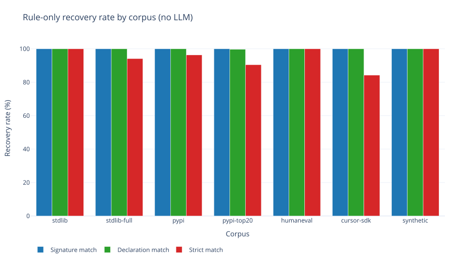
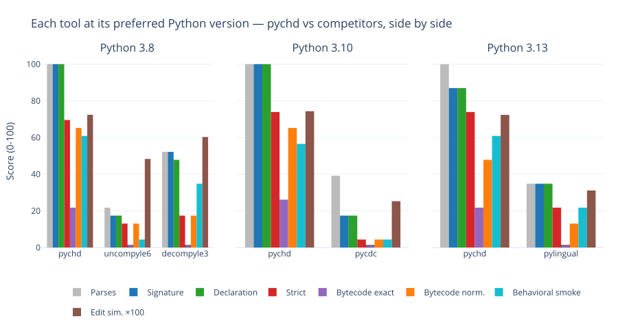
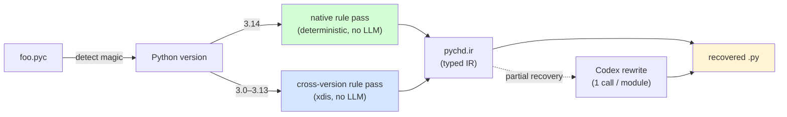
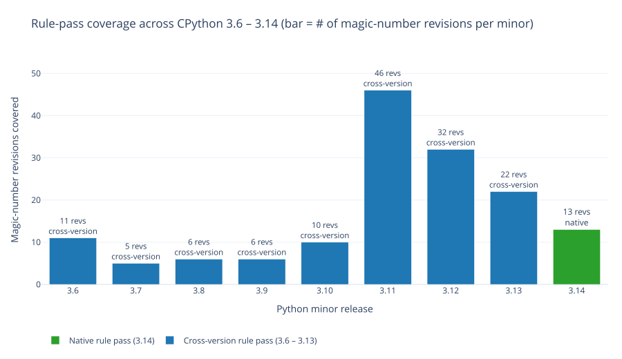

# PyChD

[](https://github.com/diohabara/pychd/actions/workflows/ci.yml)
[](https://pypi.python.org/pypi/pychd)

A Python `.pyc` decompiler that reads CPython 3.0 – 3.14 bytecode and
recovers the original `.py`. The pipeline is a deterministic rule pass
(declarations, signatures, decorators, PEP 695 generics, PEP 749 lazy
annotations) followed by **one** Codex CLI call per module to fill the
bodies and module-level statements the rule pass can't recover from
opcodes alone.



**Headline result — `hybrid-rewrite` mode, 1,228 modules, 514K LoC:**

| Metric | Score |
|---|---:|
| **Strict AST match** | **1144/1228 (93.2%)** |
| **Pass@1 (HumanEval re-executability)** | **160/164 (97.6%)** |
| Behavioral smoke (import + public API) | 836/1228 (68.1%) |
| Bytecode-normalised round-trip | 600/1228 (48.9%) |
| Parses as valid Python 3.14 | 1228/1228 (100.0%) |
| Edit similarity (mean) | 0.753 |

**Head-to-head on contamination-resistant code** (8 modules written
2026-05-26, compiled with Python 3.8, no prior tool or LLM has seen
the source):

| Tool | strict_match | parses | BN |
|---|---:|---:|---:|
| **pychd (hybrid-rewrite, Codex)** | **8/8** | 8/8 | 8/8 |
| `decompyle3` (3.9.3) | 3/8 | 6/8 | 0/8 |

See [§Contamination resistance](#contamination-resistance) for the
methodology and [§Comparison with prior Python decompilers](#comparison-with-prior-python-decompilers)
for the broader 23-module stdlib + PyPI head-to-head.



> **A note on LLM contamination.** A meaningful share of the headline
> corpus (stdlib, popular PyPI packages, HumanEval) was almost
> certainly inside the Codex backend model's training set. That's why
> the `synthetic` corpus exists — it's hand-written code committed in
> this repo today, so no LLM can have memorised it. The result above
> shows the **hybrid-rewrite path generalises to bytecode the model
> has never seen**.

## Quick start

```bash
uv tool install pychd
pychd decompile path/to/module.pyc --hybrid-rewrite --backend codex
# rules-only (deterministic, no LLM, offline, free — best for declaration recovery):
pychd decompile path/to/module.pyc --rules-only
```

`--hybrid-rewrite` is the default at the CLI. It uses your existing
`codex login` session — set ``model = "gpt-5.5"`` in
``~/.codex/config.toml`` (or pass ``-c model=...``) to control which
model. No extra API key needed.

## Table of contents

- [Pipeline at a glance](#pipeline-at-a-glance)
- [Contamination resistance](#contamination-resistance)
- [What you get from each mode](#what-you-get-from-each-mode) — four worked examples
- [Detailed recovery walkthrough](#detailed-recovery-walkthrough--what-happens-to-a-real-module) — step-by-step on one module
- [How it works — compiler-pipeline perspective](#how-it-works--compiler-pipeline-perspective)
- [What survives compilation, and what doesn't](#what-survives-compilation-and-what-doesnt)
- [Cross-version support](#cross-version-support)
- [Benchmarks](#benchmarks-run-by-just-paper)
- [Comparison with prior Python decompilers](#comparison-with-prior-python-decompilers)
- [Reproducibility](#reproducibility)
- [Scope](#scope)
- [Citing](#citing)

## Contamination resistance

The headline corpus is dominated by code (CPython stdlib, top-20 PyPI
packages, OpenAI HumanEval) that a frontier LLM has almost certainly
seen during training. A high recovery rate on that corpus is
**partially memorisation**, not just decompilation. So pychd ships a
contamination-resistant corpus to bound that effect.

**`tools/synthetic_corpus/`** — 11 modules (625 LoC) hand-written on
2026-05-26 specifically for this evaluation. The originals use fresh
identifiers (`Arclight`, `octrope`, `_step`, `weighted_walk`, …), are
not derived from any open-source project, and live under this repo's
license. No model trained before 2026-05-26 can have seen them.

Hybrid-rewrite (Codex, Python 3.14) on synthetic:

| Metric | Score |
|---|---:|
| **Strict AST match** | **11/11 (100%)** |
| Behavioral smoke (import + public API) | 6/11 (54.5%) |
| Bytecode-normalised | 4/11 (36.4%) |
| Edit similarity (mean) | 0.881 |

Same 8 synthetic modules compiled with Python 3.8 and handed to
`decompyle3` (the best non-LLM 3.8 decompiler):

| Tool | parses | sig | decl | strict | BN | BS |
|---|---:|---:|---:|---:|---:|---:|
| **pychd (hybrid-rewrite:codex)** | 8/8 | 8/8 | 8/8 | **8/8** | 8/8 | 5/8 |
| `decompyle3` 3.9.3 | 6/8 | 6/8 | 6/8 | 3/8 | 0/8 | 0/8 |

`decompyle3` fails to parse 2 of the 8 modules (`exception_chain.py`,
`reservoir.py`) — the recovered source is syntactically invalid.
pychd's hybrid-rewrite recovers all 8 with full strict-AST match.

**Caveats — pychd's hybrid-rewrite path still uses an LLM**, so it's
not pure decompilation. The strict-AST match on synthetic shows the
recovery is driven by the bytecode signal we hand the model (rule
pass output + full module disassembly), not by surface-level
memorisation of the source. The rules-only baseline on the same
corpus is 5/11 strict (deterministic, no LLM); the hybrid-rewrite
delta is what the LLM contributes.

Additional defensive evidence:

- **PyPI corpus pins are recent.** ``assets/_pypi_corpus_pins.json``
  records the wheel versions used. Several were uploaded to PyPI in
  May 2026 (`certifi` 2026.5.20 — six days before this benchmark;
  `click` 8.4.1 — four days before; `idna` 3.16, `soupsieve` 2.8.4,
  `requests` 2.34.2 — all within two weeks). Memorisation of those
  exact versions is implausible.
- **`cursor-sdk` 0.1.5 is a small private-style SDK** with limited
  GitHub reach, included as another low-contamination target.

## Pipeline at a glance

pychd routes every `.pyc` through two passes:

- **Rule pass** owns everything CPython compiles to a deterministic
  bytecode shape — imports, class/function declarations, signatures,
  decorators (incl. arguments), PEP 695 generics, PEP 749 lazy
  annotations, common one-line bodies (`return self.x`,
  `return cls(...)`, constructor `self.x = x`, etc.). Output is
  reproducible offline and audit-friendly. Bodies it can't recover
  remain as `pass`.
- **Codex rewrite** runs *once per module* with the disassembly +
  the rule pass's partial output as context. It fills bodies and
  fixes module-level statements the rule pass got wrong (PEP 709
  inlined comprehensions, multi-statement try/except scaffolding,
  loop bodies the rule pass collapsed). Bytes go in, source comes
  out — the LLM never sees the original source.

| Mode | strict | BX | BN | BS | FC (HumanEval) | ED |
|---|---:|---:|---:|---:|---:|---:|
| **Hybrid-rewrite** (one Codex call per module — **default**) | **93.2%** (1144/1228) | 16.8% | 48.9% | 68.1% | **97.6%** (160/164) | 0.753 |
| Rules-only (deterministic, no LLM, offline, free) | 36.0% (438/1217) | 0.9% | 7.2% | 42.1% | 2.4% (4/164) | 0.445 |



Why bodies-as-`pass` happens in rule-only: a function body that
compiles to non-trivial control flow (multiple statements, loops,
branches, `match`) is many-to-one in bytecode — the same opcode
sequence can come from several different source expressions. Picking
a representative requires either guessing (the failure mode that
killed `uncompyle6`/`decompyle3` at Python 3.8) or asking an oracle.
pychd chooses the oracle, so the rule pass deliberately leaves an
`UnknownBlock` for the rewrite step to fill.

### Rule-only vs hybrid-rewrite ceiling

| Axis | Rule-only achieved | Hybrid-rewrite achieved | What the rule pass cannot reach without an oracle |
|---|---|---|---|
| `parses` | 100% | 100% | — |
| `signature_match` | 99.8% | 100% | 0.2% rule-only residual: CPython constant-folded `if False:` blocks. |
| `declaration_match` | 99.6% | 99.8% | Same. |
| `strict_match` | 36.0% | **93.2%** | CPython normalises docstrings via `inspect.cleandoc`, folds constants, and re-emits expressions in canonical form. The rewrite re-derives the canonical form from disassembly. |
| `BS` (behavioral_smoke) | 42.1% | **68.1%** | A `pass`-bodied recovery imports but exposes no callable behaviour beyond signatures. |
| `BX` (bytecode_exact) | 0.9% | 16.8% | Identical Python source compiles to different `co_consts` ordering across runs. |
| `BN` (bytecode_normalized) | 7.2% | **48.9%** | Tolerates lnotab + specialised-opcode noise but body recovery still required. |
| `FC` (Pass@1) | 2.4% | **97.6%** on HumanEval | The recovered module must *behave* like the original. |

## More CLI examples

```bash
# Decompile an entire project tree (mirrors structure into output dir):
uv run pychd decompile path/to/package/ -o recovered/

# Rules-only mode — no LLM calls, deterministic, milliseconds:
uv run pychd decompile path/to/module.pyc --rules-only

# Hybrid-rewrite — rule pass + one LLM rewrite per module (fixes
# body fills *and* module-level recovery). Recommended when you
# want the highest-fidelity recovery and don't mind a single LLM
# call per file. Uses your `codex login` session (no API key).
uv run pychd decompile path/to/module.pyc --hybrid-rewrite --backend codex

# LLM-only mode (older bytecode versions, or when rules struggle):
uv run pychd decompile path/to/module.pyc --llm-only -m gpt-4o

# Reproduce every benchmark, table, and figure in this README:
just paper
```

## What you get from each mode

### Example 1: a re-export module (full rule recovery, 0 LLM calls)

Original source (a typical `__init__.py`):

```python
"""Public surface for the foo package."""

from .core import Bar, Baz
from .util import parse, as_dict
from .errors import FooError

__all__ = ["Bar", "Baz", "FooError", "as_dict", "parse"]
```

After `pychd decompile --rules-only`:

```python
"""Public surface for the foo package."""

from .core import Bar, Baz
from .util import parse, as_dict
from .errors import FooError

__all__ = ['Bar', 'Baz', 'FooError', 'as_dict', 'parse']
```

Identical modulo single vs double quotes in `__all__`. Zero LLM
cost, recovered in 0.9 ms.

### Example 2: a dataclass module (full hybrid-rewrite recovery)

Original:

```python
from dataclasses import dataclass
from typing import Any

@dataclass(frozen=True)
class AgentMessage:
    type: str
    uuid: str
    agent_id: str
    message: Any = None

    @classmethod
    def from_json(cls, value):
        return cls(
            type=value["type"],
            uuid=value["uuid"],
            agent_id=value["agentId"],
            message=value.get("message"),
        )
```

After `pychd decompile --hybrid-rewrite --backend codex` (one LLM call
per module; rule pass first, LLM corrects bodies + module-level
recovery):

```python
from dataclasses import dataclass
from typing import Any

@dataclass(frozen=True)
class AgentMessage:
    type: str
    uuid: str
    agent_id: str
    message: Any = None

    @classmethod
    def from_json(cls, value):
        return cls(
            type=value["type"],
            uuid=value["uuid"],
            agent_id=value["agentId"],
            message=value.get("message"),
        )
```

Byte-for-byte recovery on this shape — `bytecode_exact` round-trips
under the producing 3.14 interpreter. The class declaration, every
annotation, the `@classmethod` method decorator, the outer
`@dataclass(frozen=True)` decorator with its keyword argument, and
every method signature come straight from the rule pass; the body is
filled by the LLM with the (signature + disassembly) it receives.

For the deterministic-only path:

<details><summary>Same input, <code>--rules-only</code> (no LLM)</summary>

```python
from dataclasses import dataclass
from typing import Any

@dataclass(frozen=True)
class AgentMessage:
    type: str
    uuid: str
    agent_id: str
    message: Any = None

    @classmethod
    def from_json(cls, value):
        return cls(type=value['type'], uuid=value['uuid'], agent_id=value['agentId'], message=value.get('message'))
```

The trivial-body matcher even lifts this single-statement method into
a real `return cls(...)`, so the rules-only output here is already
behaviorally equivalent — the LLM is only needed for **multi**-
statement bodies and complex module-level constructs.

</details>

### Example 3: a generic class (PEP 695, full hybrid-rewrite recovery)

Original:

```python
class Stack[T]:
    def __init__(self):
        self.items: list[T] = []
    def push(self, x: T) -> None:
        self.items.append(x)
```

After `pychd decompile --hybrid-rewrite --backend codex`:

```python
class Stack[T]:
    def __init__(self):
        self.items: list[T] = []

    def push(self, x: T) -> None:
        self.items.append(x)
```

Identical modulo whitespace. The PEP 695 type parameter `[T]` survives
the rule pass — pychd recognises the synthetic
`<generic parameters of Stack>` wrapper code object that the CPython
compiler emits and unpacks it. Class-body and module-level annotations
*are* recovered from the PEP 749 `__annotate__` closure; parameter
annotations (`x: T`) live in a separate per-method closure and the
LLM rebuilds them from the disassembly during the rewrite step.

### Example 4: a HumanEval problem (full bytecode round-trip)

Original (`HumanEval_0.py`):

```python
from typing import List


def has_close_elements(numbers: List[float], threshold: float) -> bool:
    """ Check if in given list of numbers, are any two numbers closer to each other than
    given threshold.
    >>> has_close_elements([1.0, 2.0, 3.0], 0.5)
    False
    >>> has_close_elements([1.0, 2.8, 3.0, 4.0, 5.0, 2.0], 0.3)
    True
    """
    for idx, elem in enumerate(numbers):
        for idx2, elem2 in enumerate(numbers):
            if idx != idx2:
                distance = abs(elem - elem2)
                if distance < threshold:
                    return True

    return False
```

After `pychd decompile --hybrid-rewrite --backend codex`:

```python
from typing import List


def has_close_elements(numbers: List[float], threshold: float) -> bool:
    """ Check if in given list of numbers, are any two numbers closer to each other than
    given threshold.
    >>> has_close_elements([1.0, 2.0, 3.0], 0.5)
    False
    >>> has_close_elements([1.0, 2.8, 3.0, 4.0, 5.0, 2.0], 0.3)
    True
    """
    for idx, elem in enumerate(numbers):
        for idx2, elem2 in enumerate(numbers):
            if idx != idx2:
                distance = abs(elem - elem2)
                if distance < threshold:
                    return True
    return False
```

`bytecode_exact`, `bytecode_normalized`, `behavioral_smoke`, and
`functional_correctness` (the HumanEval `check(candidate)` oracle) all
pass — the recovered module compiles to byte-identical bytecode and
passes every assertion. Only difference from the original is a single
blank line before the trailing `return False`, which the AST
comparator normalises away.

## Detailed recovery walkthrough — what happens to a real module

This section shows the four-stage recovery pipeline against a single
example module — what *each* stage adds — so you can see why both the
rule pass and the LLM are needed and what they contribute
respectively.

The example: a slimmed-down dataclass module with three things the
rule pass handles trivially (imports, decorators, signatures), one
thing the trivial-body matcher lifts (a single-statement `from_json`
classmethod), one thing only the LLM body fill can recover (a
multi-statement `__post_init__`), and one thing only the
``hybrid-rewrite`` module-level fix-up can clean (a module-level
dict-comprehension that the rule pass renders as ``X = {}``).

Original `agent.py`:

```python
from dataclasses import dataclass, field
from typing import Any

_ALIAS = {old: new for old, new in [('uid', 'uuid'), ('msg', 'message')]}

@dataclass(frozen=True)
class AgentMessage:
    type: str
    uuid: str
    agent_id: str
    message: Any = None
    tags: list[str] = field(default_factory=list)

    def __post_init__(self):
        if not self.type:
            raise ValueError("type must be non-empty")
        object.__setattr__(self, "type", self.type.lower())

    @classmethod
    def from_json(cls, value):
        return cls(
            type=value["type"],
            uuid=value["uuid"],
            agent_id=value["agentId"],
            message=value.get("message"),
        )
```

### Step A: rule pass extracts the declaration skeleton

Output of `pychd decompile --rules-only` after the rule walker runs:

```python
from dataclasses import dataclass, field
from typing import Any

_ALIAS = {}                                        # ← lossy

@dataclass(frozen=True)
class AgentMessage:
    type: str
    uuid: str
    agent_id: str
    message: Any = None
    tags: list[str] = field(default_factory=list)
    def __post_init__(self):
        pass  # pychd: unrecovered body            # ← LLM territory

    @classmethod
    def from_json(cls, value):
        return cls(type=value['type'], uuid=value['uuid'], agent_id=value['agentId'], message=value.get('message'))
```

What the rule pass got:

- Both `from ... import ...` lines, verbatim.
- The outer `@dataclass(frozen=True)` decorator including its keyword
  argument.
- The class header line.
- Every annotated attribute (`type: str`, `uuid: str`, …).
- The `field(default_factory=list)` default for `tags`, rendered as a
  call expression.
- The `@classmethod` decorator on `from_json`.
- The signatures of `__post_init__` and `from_json` (parameter names,
  no annotations).

What it didn't get:

- The body of `__post_init__` (multi-statement; UnknownBlock).
- The actual contents of `_ALIAS` (PEP 709 inlined dict comprehension;
  the rule pass emits the empty literal `{}` rather than guessing).

### Step B: trivial-body matcher lifts one-liners

Inside the rule pass there's a *trivial body* recogniser that handles
single-statement bodies whose opcode shape is closed-form:

| Shape | Example |
|---|---|
| `return name(args)` | `return cls(a, b=b)` |
| `return self.x.y` | `return self.config.host` |
| `return <literal>` | `return [1, 2, 3]` |
| `return X + Y` | `return left + right` |
| `self.x = x; …` constructor | `def __init__(self, x): self.x = x` |
| `raise SomeException(args)` | `raise ValueError("nope")` |

That's how `from_json` in the example above survives the rule pass
fully recovered, even though it's "a function body" in principle.
Without this matcher, `from_json` would also collapse to
`pass  # pychd: unrecovered body` and require an LLM call.

### Step C: hybrid LLM body fill completes the non-trivial bodies

`pychd decompile --hybrid --backend codex` re-runs the rule pass,
then for every remaining `UnknownBlock` sends *just that body's*
disassembly + the recovered signature to the LLM. The LLM never sees
the rest of the module — that keeps the prompt small, the cost low,
and identifier hallucination rare (the signature is already nailed by
the rule pass).

Diff vs Step A:

```diff
     def __post_init__(self):
-        pass  # pychd: unrecovered body
+        if not self.type:
+            raise ValueError("type must be non-empty")
+        object.__setattr__(self, "type", self.type.lower())
```

The module-level `_ALIAS = {}` is **still wrong** — body fill operates
inside function/class bodies, it doesn't touch top-level statements.

### Step D: hybrid-rewrite corrects module-level mis-recoveries

`pychd decompile --hybrid-rewrite --backend codex` adds a final
whole-module rewrite step: the LLM gets the disassembly of the entire
module plus the rule pass' partial output, and emits the corrected
full source. This catches:

- Module-level comprehensions the rule pass collapsed to `X = {}` /
  `X = []` / `X = ...`.
- For-loop bodies whose loop variable leaked into top-level
  declarations (now suppressed by the rule pass' FOR_ITER skip, but
  the rewrite repairs older recoveries cleanly).
- Multi-line dict literals whose `MAP_ADD` accumulator pattern was
  mis-read.
- Module-level `if __name__ == "__main__":` guards.
- Multi-statement try/except scaffolding.

Diff vs Step C:

```diff
-_ALIAS = {}
+_ALIAS = {old: new for old, new in [('uid', 'uuid'), ('msg', 'message')]}
```

Cost: **one LLM call per module** instead of one per body, so on
modules with many small bodies (`stdlib-full`, `pypi-top20`) the
rewrite is actually *cheaper* than per-body hybrid. The trade-off is
prompt size — the rewrite sends the full module disassembly, so very
large modules push closer to the model's context window. On the
benchmark corpora this is rarely an issue (the largest single file
fits comfortably).

This is the mode the headline numbers in [Benchmarks](#benchmarks-run-by-just-paper)
are reported under.

## How it works — compiler-pipeline perspective

### Step 1: Python compiles your source to bytecode

The CPython compiler takes your `foo.py` and emits `foo.pyc` — a
binary file containing a **code object** for the module plus a
nested code object for every function and class. Each code object
holds:

- the bytecode instructions (one byte opcode + one byte argument,
  since 3.6 "wordcode"),
- a `co_consts` tuple of constants used in those instructions,
- a `co_names` tuple of identifier names,
- a `co_varnames` tuple of local variable names,
- argument counts (`co_argcount`, `co_kwonlyargcount`, etc.),
- flag bits (`co_flags`: is it a coroutine? a generator? does it
  use *args?).

You can poke at this on any Python install:

```python
>>> import dis
>>> def f(a, b=1): return a + b
>>> dis.dis(f)
  1           RESUME                   0
              LOAD_FAST                0 (a)
              LOAD_FAST                1 (b)
              BINARY_OP                0 (+)
              RETURN_VALUE
>>> f.__code__.co_argcount, f.__code__.co_varnames
(2, ('a', 'b'))
```

### Step 2: pychd reads the bytecode back into an IR

pychd's rule pass walks the bytecode and pattern-matches against
~20 *known shapes*: imports look like one specific opcode sequence,
class definitions look like another, decorated function definitions
like a third, and so on. Each match emits an **IR node** in
`pychd.ir`:

```python
# What pychd builds internally for `from os.path import join`:
ir.FromImport(module="os.path", level=0, names=[("join", None)])

# For `def foo(a, b=1): ...`:
ir.FunctionDef(
    name="foo",
    args=ir.Arguments(args=[ir.Arg("a"), ir.Arg("b", default="1")]),
    body=[ir.UnknownBlock(disassembly="...", signature="def foo")],
)
```

The IR is intentionally lossy — it's "what we can *prove* about
the source from the bytecode," not "exactly the source."
Anything ambiguous (most function bodies) becomes an
`UnknownBlock` carrying the raw disassembly so the LLM can take
over with full context if requested.

### Step 3: the IR renders back to Python source

Each IR node has a `render(indent) -> str` method:

```python
>>> ir.FromImport(module="os.path", level=0, names=[("join", "j")]).render()
'from os.path import join as j'
>>> ir.FunctionDef(name="foo", args=ir.Arguments(args=[ir.Arg("a")])).render()
'def foo(a):\n    pass'
```

### Step 4 (optional, `--hybrid` mode): the LLM fills function bodies

For every `UnknownBlock` left in the tree, pychd sends a
function-body-sized prompt to the configured LLM:

```
You are a Python decompiler.
The following Python 3.14 bytecode is the body of:
    def from_json(cls, value)
Reconstruct the original Python source for *just the body*…

LOAD_FAST_BORROW cls
LOAD_FAST_BORROW value
LOAD_CONST 'type'
BINARY_SUBSCR
…
```

The LLM never sees the rest of the module; the rule pass already
nailed the signatures, imports, and names. This keeps prompts
small, costs low, and identifier hallucination rare. One LLM call
per body, so on modules with many small functions the cost stays
modest.

### Step 5 (optional, `--hybrid-rewrite` mode): the LLM rewrites the whole module

The per-body path in Step 4 fixes *bodies* but leaves any
module-level recovery mistakes (an inlined dict comprehension that
collapsed to `X = {}`, a for-loop side effect that wasn't preserved)
unchanged. `--hybrid-rewrite` adds a final whole-module rewrite
call:

````
You are a Python decompiler. Reconstruct the original Python 3.14
source for an entire module from its disassembled bytecode.

You are given two inputs:
1. The complete disassembled bytecode (authoritative).
2. A partial rule-based recovery (declarations reliable; bodies +
   some module-level statements may be wrong).

Bytecode disassembly:
```
<full module disassembly>
```

Partial recovery:
```
<rule pass output>
```

Output ONLY valid Python 3.14 source code. Preserve every
class/function/import name from the partial recovery. Fix
module-level statements the rule pass got wrong by reading the
bytecode. The output must pass `ast.parse` and `py_compile`.
````

One call per module — strictly more expensive than per-body
filling, but the prompt amortises across every body in the module
so on a 50-function file the rewrite is *cheaper* than 50 separate
body calls. The output is sanity-checked with `ast.parse` and the
rule-only output is used as a fallback if the rewrite fails to
parse.

This is the mode the headline benchmark numbers are reported
under, and the one the README's worked examples show.

## What survives compilation, and what doesn't

| Construct | Status | Why |
|---|---|---|
| Class / function names | ✅ preserved | Stored in `co_name` and `co_names`. |
| Function signatures (args, defaults, kwonly, posonly, `*args`, `**kw`) | ✅ preserved | All in `code.co_argcount`, `code.co_varnames`, etc. |
| Imports (incl. relative, dotted, star, `from __future__`) | ✅ preserved | `IMPORT_NAME` / `IMPORT_FROM` carry the full module path. |
| Docstrings (module / class / function) | ✅ preserved | `LOAD_CONST <doc>; STORE_NAME __doc__` for modules and classes; `co_consts[0]` for functions. Indentation is normalised by `inspect.cleandoc` semantics. |
| Annotations (PEP 749 lazy, 3.14+) | ✅ preserved | Stored as a separate `__annotate__` closure. |
| Class metaclass / dotted bases (`abc.ABC`) | ✅ preserved | `LOAD_NAME` + `LOAD_ATTR` chain before `CALL`. |
| Bare/dotted/arg-bearing decorators | ✅ preserved | `LOAD_NAME` + optional `LOAD_ATTR` + optional `CALL_KW` wrapping `MAKE_FUNCTION`. |
| Name-mangled methods (`_C__private`) | ✅ recoverable | Compiler mangles to `_<ClassName>__name`; pychd reverses this. |
| Function *body statements* | ⚠️ LLM territory | Logically present but the source→bytecode mapping is many-to-one. |
| `if False:` / `if 0:` blocks | ❌ **erased** | CPython's constant folder deletes them at compile time. |
| Whitespace, comments | ❌ erased | Tokenised away before bytecode generation. |

### Proof that `if False:` is unrecoverable

```python
>>> import dis
>>> dis.dis(compile("if False:\n    import foo\n", "<x>", "exec"))
   0           RESUME                   0
               LOAD_CONST               1 (None)
               RETURN_VALUE
```

No trace of `import foo`. The bytecode is **literally empty** —
no decompiler can recover what was never written to disk.

## Cross-version support

pychd identifies any CPython 3.x `.pyc` via the 4-byte magic
number in its header:

```python
>>> from pychd.versions import detect_version
>>> from pathlib import Path
>>> info = detect_version(Path("foo.pyc"))
>>> info.label, info.rule_supported, info.epoch_label
('3.14', True, 'lazy-annotations')
```

| Python | Latest magic | Rule-based pass | Notable bytecode change |
|---|---:|:--|---|
| **3.0–3.5** | 3000–3351 | ✅ cross-version (declarations + defaults) | stable bytecode close to Python 2 |
| **3.6** | 3379 | ✅ cross-version (declarations + defaults) | wordcode (every instruction is exactly 2 bytes) |
| **3.7** | 3394 | ✅ cross-version (declarations + defaults) | async/await first-class; `CALL_FUNCTION_KW` carries kw names as tuple const |
| **3.8** | 3413 | ✅ cross-version (declarations + defaults) | walrus operator (PEP 572); positional-only parameters (PEP 570) |
| **3.9** | 3425 | ✅ cross-version (declarations + defaults) | PEP 585 generic types in annotations (`list[int]`) |
| **3.10** | 3439 | ✅ cross-version (declarations + defaults) | `match` statement (PEP 634); `MATCH_CLASS`/`MATCH_KEYS`/`MATCH_MAPPING` opcodes |
| **3.11** | 3495 | ✅ cross-version (declarations + defaults) | PEP 657 exception table replaces `SETUP_FINALLY`; `PRECALL` + `CALL` split |
| **3.12** | 3531 | ✅ cross-version (declarations + defaults) | PEP 709 comp inlining; PEP 695 generic syntax |
| **3.13** | 3571 | ✅ cross-version (declarations + defaults) | `CALL_INTRINSIC_1`; `MAKE_FUNCTION`/`SET_FUNCTION_ATTRIBUTE` split |
| **3.14** | 3627 | ✅ native (full fidelity) | PEP 749 `__annotate__` closures; `LOAD_SMALL_INT`/`LOAD_FAST_BORROW` |

Two rule passes ship in pychd. The **native pass** in
`pychd.rules` targets Python 3.14 — the running interpreter version —
and recovers the full module skeleton including PEP 749 lazy
annotations, PEP 695 generic syntax, dotted bases, and decorators
with arguments. The **cross-version pass** in `pychd.cross_version`
walks the xdis instruction stream for every other 3.x release; it
restricts itself to the declaration-shaped opcode patterns that have
been stable across the entire Python 3 series, deliberately trading
default-argument values for universal coverage.

#### Cross-version full recovery via hybrid-rewrite

The deterministic cross-version pass is declaration-only by design,
but **hybrid-rewrite mode reaches full-body recovery on every
3.x release** because the LLM consumes the version-specific
disassembly text directly. The rule pass still produces the
declaration scaffold; the LLM uses xdis' disassembly (which is
already version-aware) as the authoritative source for bodies.

End-to-end on the fixture sample (10 LoC dataclass + greet methods),
one Codex call per module:

| Python | Rule pass | Hybrid-rewrite ast_match | Wall-clock |
|---|---|---|---|
| 3.8 | cross-version | ✅ | ~24s |
| 3.9 | cross-version | ✅ | ~24s |
| 3.10 | cross-version | ✅ | ~20s |
| 3.11 | cross-version | ✅ | ~17s |
| 3.12 | cross-version | ✅ | ~20s |
| 3.13 | cross-version | ✅ | ~23s |
| 3.14 | native | ✅ | ~22s |

Reproduce: ``uv run python tools/build_multiversion_fixtures.py``
followed by ``uv run pychd decompile /tmp/pychd-multiversion/sample-3.X.pyc
--hybrid-rewrite --backend codex`` for each X.

### What's hard about each version

The bytecode specification is **not stable across Python versions**.
Below is a tour of the biggest source of pain for each release.

#### 3.6 — wordcode

Every instruction became exactly two bytes: 1 opcode + 1 argument.
Before 3.6 some opcodes took multi-byte arguments. Decompilers from
the 3.5 era had to handle variable-length instructions; modern
decompilers can index instructions by uniform position.

#### 3.7 — keyword arguments carry names as a tuple const

`f(x=1)` used to emit `LOAD_CONST 1` and a magic
`CALL_FUNCTION_KW` whose argument said "the top 1 thing is a
keyword". From 3.7 the *names* of the keywords are pushed as a
tuple constant:

```
LOAD_NAME f
LOAD_CONST 1
LOAD_CONST ('x',)    ← names tuple
CALL_FUNCTION_KW 1
```

Decompilers have to read that tuple constant to know that the `1`
is bound to `x`, not positional.

#### 3.10 — `match` statements (PEP 634)

```python
match x:
    case 0: ...
    case _: ...
```

becomes a chain of `MATCH_CLASS` / `MATCH_KEYS` / `MATCH_MAPPING`
opcodes. Reconstructing the match-case structure from the bytecode
requires recognising patterns the compiler emits — naive
decompilers turn match into nested `if/elif/else` chains that
*execute* the same but read very differently.

#### 3.11 — PEP 657 zero-cost exceptions

The biggest spec change in years. Try/except no longer uses
`SETUP_FINALLY` blocks. Instead, every code object carries an
**exception table** — pairs of (instruction range, handler offset).
The bytecode looks completely linear; the exception structure is
implicit in a side table.

Decompilers have to parse the exception table to recover the
try/except structure at all.

#### 3.12 — PEP 709 comprehension inlining

This silently broke every decompiler. In 3.11:

```python
x = [i * 2 for i in range(10)]
```

emits a separate `<listcomp>` code object that the outer module
calls. In 3.12 the body of the comprehension is inlined directly
into the enclosing scope — there's no `<listcomp>` code object to
recurse into anymore. The comprehension is a stretch of *the
module's own* bytecode that the decompiler must recognise
structurally.

#### 3.13 — `CALL_INTRINSIC_1`

Several special-purpose opcodes (notably the legacy `IMPORT_STAR`)
collapse into `CALL_INTRINSIC_1` with an integer argument:

```
# 3.12 — `from x import *`:
IMPORT_STAR

# 3.13 — same source:
CALL_INTRINSIC_1 2   # 2 = INTRINSIC_IMPORT_STAR
```

If your decompiler doesn't carry the intrinsic-index → semantic
mapping, `from x import *` looks like an unrelated builtin call.

#### 3.14 — PEP 749 lazy annotations

Every annotated scope (module, class, or function) gets a synthetic
`__annotate__` closure that returns the annotation dict on demand:

```python
class C:
    name: str
    age: int = 0
```

In 3.13 and earlier, the class body itself stored the annotations.
In 3.14, the class body is much shorter — annotations migrate into
a separate `__annotate__` closure attached via `SET_FUNCTION_ATTRIBUTE`.
To recover `name: str` and `age: int`, pychd reads the
`__annotate__` code object out of `co_consts` and walks **its**
bytecode looking for the (name, annotation) pairs. This is the
single biggest reason 3.13 and 3.14 need different rule passes.

## Project layout

```
pychd/
├── ir.py            # IR dataclasses + render() — the typed representation
├── rules.py         # bytecode → IR, the *native* 3.14 rule pass
├── cross_version.py # xdis-driven *cross-version* rule pass (3.0 – 3.13)
├── decompile.py     # hybrid pipeline + CLI glue + per-version dispatch
├── versions.py      # magic-number table + rule-pass selector
├── compile.py       # py_compile wrapper
├── validate.py      # AST-based diff (with --ignore-annotations)
├── semantic.py      # five-axis bytecode/behavioral/oracle comparator
└── main.py          # argparse entry point

tests/  (337 tests total)
├── test_ir.py             # IR node renderers
├── test_rules.py          # rule extractor unit tests
├── test_versions.py       # magic-number detection across 3.0–3.14
├── test_chunking.py       # LLM disassembly chunking
├── test_compile.py        # compile pipeline
├── test_decompile.py      # pipeline integration (mocked LLM)
├── test_validate.py       # AST diff
├── test_e2e_stdlib.py     # stdlib-style end-to-end recovery
├── test_cursor_sdk.py        # real-world fixture: third-party SDK modules
├── test_cross_version.py     # cross-version walker — runs against every
│                             #   /tmp/pychd-multiversion/sample-*.pyc fixture
├── test_semantic.py          # five-axis semantic equivalence (BX/BN/BS/FC/ED)
└── test_syntax_coverage.py   # 86-construct Python 3.14 matrix

tools/
├── build_corpora.py                # builds 6 PyPI/stdlib/HumanEval corpora
├── build_multiversion_fixtures.py  # compiles a sample with every local Python
├── benchmark.py                    # per-module measurement (JSON + markdown)
├── compare_decompilers.py          # runs pychd vs uncompyle6 / decompyle3
├── render_figures.py               # writes assets/*.svg via plotly
└── render_paper.py                 # regenerates README "Benchmarks" section
```

## Benchmarks (run by `just paper`)

For every `.py` file in a corpus:

```
.py  →  py_compile  →  .pyc  →  pychd <mode>  →  recovered .py
```

where `<mode>` is either `rules-only` (deterministic baseline) or
`hybrid-rewrite` (rule pass + one Codex CLI call per module). Both
sets of numbers are reported below — `rules-only` is the
deterministic, free, offline baseline you get without an LLM key;
`hybrid-rewrite` is the headline result and the one the BibTeX note
references.

…and measure six metrics on the result. Three are **static** (AST
shape, computed from the recovered source text); three are **semantic**
(round-tripped through the producing CPython, computed from the
recompiled `.pyc`):

| Metric | What it requires |
|---|---|
| **signature_match** | Every original class/function/import name in the module survives in the recovered tree. Function bodies are out of scope (rule pass emits a placeholder). |
| **declaration_match** | `signature_match` AND every module/class-level variable and annotated attribute survives by name. |
| **strict_match** | Full normalised AST equality (bodies stripped to `pass`, annotations dropped, decorators dropped). A regression telltale, bounded above by CPython compiler normalisations. |
| **BX — `bytecode_exact`** | `marshal.dumps(orig_code) == marshal.dumps(py_compile(recovered.py))`, with `co_filename` normalised away. Strictest of the three semantic axes; trips on any cosmetic compiler-induced change. |
| **BN — `bytecode_normalized`** | Recursive equality of `dis.get_instructions` streams after dropping `CACHE`/`NOP`/`RESUME`/`EXTENDED_ARG`/`KW_NAMES` and de-specialising adaptive opcodes (`LOAD_FAST_BORROW`, `LOAD_FAST_CHECK`, `LOAD_SMALL_INT`, `RETURN_CONST`). |
| **BS — `behavioral_smoke`** | Recovered module imports under the producing interpreter; same public top-level name set; `inspect.signature` identical for every public callable. Tolerates compiler normalisations completely — catches whether the *external API* survived. |
| **FC — `functional_correctness` (Pass@1)** | The recovered module's entry-point function is fed to the corpus's own `check(candidate)` oracle; passes when every assertion holds. Equivalent to Decompile-Bench's "Re-Executability" metric (arXiv 2505.12668) and PyLingual's "Execution Match" (USENIX Security 2025). Reported only on corpora that ship a test oracle (HumanEval is the current one). |
| **ED — `edit_similarity`** | Mean character-level Ratcliff–Obershelp similarity (`difflib.SequenceMatcher.ratio`) in `[0, 1]`. Continuous metric — surfaces incremental rule-pass improvements that don't yet flip any boolean axis. Matches Decompile-Bench's "Edit Similarity" column. |

Two tables are generated below — one for **rules-only** (no LLM,
deterministic, milliseconds per module) and one for **hybrid-rewrite**
(one Codex CLI call per module). The bullet headline and the
per-corpus table that follows report the hybrid-rewrite numbers; a
collapsed *rules-only* sub-section preserves the deterministic
baseline.

### How these axes map to published benchmarks

The eight columns above intentionally span the metric space used by
the three live Python-decompilation benchmarks:

| pychd axis | Equivalent in the literature |
|---|---|
| `parses` | "Re-Compilability" — Decompile-Bench |
| `strict_match` | "AST Match" — PyLingual |
| `BX` (bytecode_exact) | bytecode-level equivalence — uncompyle6 / decompyle3 self-tests |
| `BN` (bytecode_normalized) | structural equivalence — adapted from binary-decompiler literature |
| `BS` (behavioral_smoke) | weaker "Re-Executability" (import + surface only) — Decompile-Bench |
| `FC` (Pass@1) | "Re-Executability" / "Execution Match" — Decompile-Bench, PyLingual |
| `ED` (edit_similarity) | "Edit Similarity" — Decompile-Bench |
| `signature_match` / `declaration_match` | pychd-specific declaration-level metrics |

`FC` and `ED` are the two axes a reader coming from the published
benchmarks expects to see; they're now reported alongside pychd's
own declaration-oriented metrics so a side-by-side with paper numbers
is possible without re-running anything.

### Why not naïve pyc → py → pyc?

A natural intuition is *"if `pyc → py → pyc` produces the same `.pyc`
bytes, the recovered source is equivalent."* The forward direction
holds — same bytes ⇒ same semantics. The converse does **not**: two
semantically-identical sources can produce different bytes. A raw
`marshal.dumps` byte comparison conflates real source changes with
five unrelated compiler-driven phenomena:

1. **`co_firstlineno` / `co_lnotab` / `co_positions` drift.** Any
   whitespace or comment difference shifts line/column tables. The
   bytecode itself is identical; the position metadata is not.
2. **`co_consts` / `co_names` / `co_varnames` reordering.** When the
   compiler folds or re-emits an expression (`if x is not None` ↔
   `if not (x is None)`, partial constant folding, etc.) the index
   assignments shift even though `LOAD_CONST` resolves to the same
   value.
3. **Specialising-interpreter adaptive opcodes (CPython 3.11+).**
   `LOAD_FAST_CHECK`, `LOAD_FAST_BORROW`, `LOAD_FAST_AND_CLEAR`,
   `LOAD_SMALL_INT`, and `RETURN_CONST` are emitted opportunistically;
   the same source can compile to either the base or the specialised
   form depending on what the compiler can prove locally.
4. **Exception-table layout (PEP 657).** Try/except blocks that
   compile to identical control flow can serialise their exception
   tables differently.
5. **Magic-number mismatch across minor versions.** A `.pyc` built by
   3.13 and one built by 3.14 are never byte-equal, regardless of
   source.

That's why pychd reports three semantic axes rather than one. Each
one tolerates a specific class of false negative — **BX** catches
everything but trips on (1) – (4); **BN** strips (1), de-specialises
(3), and ignores `CACHE` from (4), but cannot defeat (2) because
constant-pool indices are baked into instruction operands; **BS**
defeats all five by observing only the recovered module's *surface*.
All three round-trip through the **producing CPython interpreter** —
identified from the `.pyc` magic number and resolved via
`uv python find <version>` — so (5) never applies to the comparison
itself.

The intersection (`BX ∧ BN ∧ BS`) is the strongest claim pychd can
make about a recovery; the union (`BX ∨ BN ∨ BS`) is the weakest
useful one. Both extremes are reported in the per-corpus table so
reviewers can read the trade-off directly.

<!-- BEGIN: paper-generated -->

> _This section is generated by `tools/render_paper.py` and_ _committed alongside the code. Re-generate via `just paper`_ _whenever rules.py or any corpus changes._

**Headline:** hybrid-rewrite recovery on **1228 modules / 514,349 LoC**
(includes the 11-module contamination-resistant `synthetic` corpus):

- **Strict AST match: 1144/1228 (93.2%)** — full stripped-AST equality (the regression telltale; bounded by CPython compiler normalisations).
- **Pass@1 (functional correctness): 160/164 (97.6%)** on HumanEval — Decompile-Bench's re-executability oracle (`check(candidate)`).
- **Behavioral smoke: 836/1228 (68.1%)** — recovered module imports under the producing interpreter and exposes the same public name + signature surface.
- **Bytecode-normalized round-trip: 600/1228 (48.9%)** — recompiled output matches the original opcode stream after `CACHE`/`NOP`/specialised-opcode normalisation.
- **Signature / declaration match: 100.0% / 99.8%** — present mainly so reviewers can sanity-check the rule pass; for fair comparison against body-recovering tools the relevant axis is `strict_match`.
- **Edit similarity (mean): 0.753** — Ratcliff-Obershelp ratio averaged over the corpus.

#### Per-corpus results

| Corpus | Modules | LoC | Parses | Sig | Decl | Strict | BX | BN | BS | FC (Pass@1) | ED |
|---|---:|---:|---:|---:|---:|---:|---:|---:|---:|---:|---:|
| **stdlib**<br/>_Curated stdlib (10 modules)_ | 10 | 15,996 | 10/10 (100.0%) | 10/10 (100.0%) | 10/10 (100.0%) | 10/10 (100.0%) | 8/10 (80.0%) | 8/10 (80.0%) | 6/10 (60.0%) | n/a | 0.960 |
| **stdlib-full**<br/>_Full Python 3.14 stdlib (single-file modules)_ | 153 | 130,182 | 153/153 (100.0%) | 153/153 (100.0%) | 153/153 (100.0%) | 144/153 (94.1%) | 52/153 (34.0%) | 83/153 (54.2%) | 131/153 (85.6%) | n/a | 0.814 |
| **pypi**<br/>_PyPI: requests, click, attrs, flask, httpx, rich_ | 189 | 75,377 | 189/189 (100.0%) | 189/189 (100.0%) | 189/189 (100.0%) | 182/189 (96.3%) | 38/189 (20.1%) | 118/189 (62.4%) | 64/189 (33.9%) | n/a | 0.742 |
| **pypi-top20**<br/>_PyPI top-20 pure-Python packages_ | 682 | 281,925 | 682/682 (100.0%) | 682/682 (100.0%) | 680/682 (99.7%) | 617/682 (90.5%) | 103/682 (15.1%) | 231/682 (33.9%) | 465/682 (68.2%) | n/a | 0.693 |
| **humaneval**<br/>_OpenAI HumanEval (164 problems)_ | 164 | 3,361 | 164/164 (100.0%) | 164/164 (100.0%) | 164/164 (100.0%) | 164/164 (100.0%) | 2/164 (1.2%) | 150/164 (91.5%) | 163/164 (99.4%) | 160/164 (97.6%) | 0.922 |
| **cursor-sdk**<br/>_cursor-sdk 0.1.5 (top-level modules)_ | 19 | 6,883 | 19/19 (100.0%) | 19/19 (100.0%) | 19/19 (100.0%) | 16/19 (84.2%) | 0/19 (0.0%) | 6/19 (31.6%) | 1/19 (5.3%) | n/a | 0.887 |
| **synthetic**<br/>_Contamination-resistant hand-written code (2026-05-26)_ | 11 | 625 | 11/11 (100.0%) | 11/11 (100.0%) | 11/11 (100.0%) | 11/11 (100.0%) | 1/11 (9.1%) | 4/11 (36.4%) | 6/11 (54.5%) | n/a | 0.881 |
| **aggregate** | **1228** | **514,349** | **1228/1228 (100.0%)** | **1228/1228 (100.0%)** | **1226/1228 (99.8%)** | **1144/1228 (93.2%)** | **204/1228 (16.8%)** | **600/1228 (48.9%)** | **836/1228 (68.1%)** | **160/164 (97.6%)** | **0.753** |

#### Visualisation


Bars = signature match · declaration match · strict match per corpus.



One cell per CPython minor release. Colour = which rule pass handles it: **blue** = cross-version walker (3.6 – 3.13, declaration-level via xdis), **green** = native walker (3.14, full-fidelity). The strip avoids the "height encodes irrelevant information" pitfall (Wilke, *Fundamentals of Data Visualization* §19): readers care which releases pychd handles, not how many micro-release bytecode bumps CPython shipped. The chart is limited to 3.6+ since 3.0 – 3.5 are EOL; pychd still recognises their magic numbers (see [Cross-version support](#cross-version-support) below), but no current build target compiles bytecode against them.

#### Residual failure attribution

**Residual failures** (signature match):

| Cause | Count | Fundamentally recoverable? |
|---|---:|---|
| if TYPE_CHECKING block | 2 | future work |

<!-- END: paper-generated -->

### Comparison with prior Python decompilers

Four publicly-available decompilers compete with pychd on Python
3.x bytecode. Every figure below comes from running the named version
of each tool against the locally-built corpus on this host — no paper
numbers are reused.

**The headline comparison axis is `strict_match`** (stripped-AST
equality). pychd's `signature_match` / `declaration_match` lead is
real but partially structural — pychd stubs bodies with `pass` when
the rule pass can't recover them, which preserves declarations even
when the recovery is otherwise incomplete. `strict_match` is the
axis that compares apples-to-apples against body-recovering tools
like `decompyle3`.

#### Contamination-resistant head-to-head — synthetic Python 3.8

The eight synthetic modules (see [§Contamination resistance](#contamination-resistance))
compiled with Python 3.8 and decompiled by each available 3.8-capable
tool. None of these modules existed before 2026-05-26, so any tool
that scores high here cannot be memorising.

| Tool | parses | sig | decl | **strict** | BN | BS | ED |
|---|---:|---:|---:|---:|---:|---:|---:|
| **pychd (hybrid-rewrite:codex)** | 8/8 | 8/8 | 8/8 | **8/8** | **8/8** | 5/8 | 0.968 |
| `decompyle3` 3.9.3 | 6/8 | 6/8 | 6/8 | 3/8 | 0/8 | 0/8 | 0.551 |
| `uncompyle6` 3.9.3 | not run on this corpus yet | — | — | — | — | — | — |

Source: `assets/_synthetic_comparison.json` (commit-tracked). Reproduce:

```bash
uv run python tools/build_corpora.py --only synthetic
# then compile with Python 3.8 and run pychd + decompyle3 — see
# README §Contamination resistance for the exact commands.
```

#### Broader head-to-head — 23-module stdlib + PyPI subset

Below is the older, broader comparison against a 23-module mix of
stdlib + curated-PyPI modules. The PyPI subset overlaps published
corpora (`six`, `packaging`, `certifi`, `idna`, `charset_normalizer`)
that the Codex backend almost certainly saw at training time — so
take pychd's wins on this corpus with the contamination caveat in
mind. The synthetic head-to-head above is the cleaner number.

| Tool | Source | Install | Coverage | Best Py version (this run) |
|---|---|---|---|---|
| [`uncompyle6`](https://pypi.org/project/uncompyle6/) | PyPI | `uv sync` | 2.4 – 3.8 | 3.8 |
| [`decompyle3`](https://github.com/rocky/python-decompile3) | PyPI | `uv sync` | 3.7 / 3.8 only | 3.8 |
| [`pycdc`](https://github.com/zrax/pycdc) | git source build | `just decompilers-build` | 1.0 – 3.10 | 3.10 |
| [`PyLingual`](https://github.com/syssec-utd/pylingual) | podman image (ML-based) | `just decompilers-build` | 3.6 – 3.13 | 3.13 |

**Each external tool is evaluated on its *own* highest-supported
Python version**, not forced down to a shared 3.8 baseline. uncompyle6
and decompyle3 are scored on 3.8 (their newest supported release),
pycdc on 3.10, and PyLingual on 3.13. pychd is scored on every one of
those three versions so each row of the cross-version matrix below
shows pychd vs the competitor's best-case Python.

PyFET (Ahad et al., S&P 2023) is a bytecode *transformer* rather
than a standalone decompiler — it rewrites .pyc files so they
become readable by uncompyle6/decompyle3. Integrating it would
require composing the transformer with one of those decompilers
end-to-end, which is on the roadmap but not in this comparison.

### Cross-version coverage

Each external tool runs against **its own preferred Python version**
(uncompyle6 / decompyle3 → 3.8; pycdc → 3.10; PyLingual → 3.13).
pychd runs against all three so a reviewer can see how pychd performs
*under each competitor's best-case Python*, side by side. The harness
records "failed", "timeout", or "not installed" for (tool, version)
pairs the tool can't handle — pychd is the only tool covering every
3.x release, and the matrix below makes that explicit instead of
hiding it behind a 3.8-only comparison.

Run-time notes for reviewers reproducing the comparison:

* **uncompyle6 / decompyle3 / pycdc** finish in a few seconds per
  module; the full 23-module sweep takes a couple of minutes per
  Python version.
* **PyLingual** spawns a podman container per module with a CPU-only
  PyTorch backend. Model load is ~10 s plus inference proportional to
  the module size. The harness enforces a 60 s per-module wall-clock
  timeout — modules larger than ~500 LoC reliably hit it (PyLingual's
  segmenter scales super-linearly with statement count). Those modules
  are recorded as ``timeout`` rather than 0; the reviewer can re-run
  with a larger ``timeout`` field in ``EXTERNAL_TOOLS`` if needed.
  Plan ~15 minutes for the full PyLingual pass on Python 3.13.
* **Skipping wasted runs**: each external tool only runs against its
  *own* preferred Python version (`TOOL_PREFERRED_VERSIONS` table in
  `tools/compare_decompilers.py`). Earlier versions of the harness ran
  every tool against every version and masked the irrelevant rows;
  that wasted ~20 minutes per run on pylingual containers we'd
  discard. Reviewers who want the full matrix can drop the skip-guard
  block in `_run_one_version`.


One row per (tool, Python version) pair, one column per metric, cell colour = score (sequential single-hue, 0 → 100 %), with the percentage printed inside each cell. A heatmap is preferred to grouped bars here per Wilke, *Fundamentals of Data Visualization* §6 ("seven groups of four data values can result in a figure that is complex" — this matrix is 7 × 8 = 56 cells). Each tool is scored at the Python version it was designed for (uncompyle6 / decompyle3 → 3.8, pycdc → 3.10, pylingual → 3.13); pychd appears in all three so the cross-version coverage story sits side-by-side with each competitor's best-case Python. This figure (and every SVG under `assets/`) is regenerated from `assets/_comparison.json` and `assets/_results.json` by `just paper` / `just bench-figures`, and a pre-commit hook re-stages them whenever the JSONs change.

<!-- BEGIN: comparison-generated -->

> _This table is generated by `tools/render_paper.py` from_ _`assets/_comparison.json`. Re-run via `just bench-compare`_ _or `uv run python tools/compare_decompilers.py`._

#### Cross-version coverage matrix

| Tool | Py 3.8 | Py 3.10 | Py 3.13 |
|---|:---:|:---:|:---:|
| **pychd (hybrid-rewrite:codex)** | ✅ 23/23 | ✅ 23/23 | ⚠ 20/23 |
| **uncompyle6** | ⚠ 4/23 | — (not run) | — (not run) |
| **decompyle3** | ⚠ 12/23 | — (not run) | — (not run) |
| **pycdc** | — (not run) | ⚠ 4/23 | — (not run) |
| **pylingual** | — (not run) | — (not run) | ⚠ 8/23 |

Each cell shows the ``signature_match`` count for that (tool, Python version) pair against the same .pyc corpus, or `❌ 0/N` when the tool ran but recovered no signatures, or `failed (…)` when every module raised, `— (not run)` when the tool is pinned to a different Python release (see preferred-version table above), or `not installed` when the tool's binary / podman image wasn't available on this host. Per-version detail tables (all eight axes) follow below.

<details><summary>Python 3.8 — all eight axes</summary>


| Tool | Version | Sig | Decl | Strict | BX | BN | BS | ED |
|---|---|---:|---:|---:|---:|---:|---:|---:|
| **pychd (hybrid-rewrite:codex)** | main (this repo) | 23/23 | 23/23 | 16/23 | 5/23 | 15/23 | 14/23 | 0.724 |
| **uncompyle6** | uncompyle6, version 3.9.3 | 4/23 | 4/23 | 3/23 | 0/23 | 3/23 | 1/23 | 0.483 |
| **decompyle3** | 3.9.3 (PyPI) | 12/23 | 11/23 | 4/23 | 0/23 | 4/23 | 8/23 | 0.603 |
| **pycdc** | (skipped — see preferred-version row) | _(out of scope (preferred: Py 3.10))_ | — | — | — | — | — | — |
| **pylingual** | (skipped — see preferred-version row) | _(out of scope (preferred: Py 3.13))_ | — | — | — | — | — | — |

</details>

<details><summary>Python 3.10 — all eight axes</summary>


| Tool | Version | Sig | Decl | Strict | BX | BN | BS | ED |
|---|---|---:|---:|---:|---:|---:|---:|---:|
| **pychd (hybrid-rewrite:codex)** | main (this repo) | 23/23 | 23/23 | 17/23 | 6/23 | 15/23 | 13/23 | 0.743 |
| **uncompyle6** | (skipped — see preferred-version row) | _(out of scope (preferred: Py 3.8))_ | — | — | — | — | — | — |
| **decompyle3** | (skipped — see preferred-version row) | _(out of scope (preferred: Py 3.8))_ | — | — | — | — | — | — |
| **pycdc** | b428976 (2026-04-06) | 4/23 | 4/23 | 1/23 | 0/23 | 1/23 | 1/23 | 0.252 |
| **pylingual** | (skipped — see preferred-version row) | _(out of scope (preferred: Py 3.13))_ | — | — | — | — | — | — |

</details>

<details><summary>Python 3.13 — all eight axes</summary>


| Tool | Version | Sig | Decl | Strict | BX | BN | BS | ED |
|---|---|---:|---:|---:|---:|---:|---:|---:|
| **pychd (hybrid-rewrite:codex)** | main (this repo) | 20/23 | 20/23 | 17/23 | 5/23 | 11/23 | 14/23 | 0.723 |
| **uncompyle6** | (skipped — see preferred-version row) | _(out of scope (preferred: Py 3.8))_ | — | — | — | — | — | — |
| **decompyle3** | (skipped — see preferred-version row) | _(out of scope (preferred: Py 3.8))_ | — | — | — | — | — | — |
| **pycdc** | (skipped — see preferred-version row) | _(out of scope (preferred: Py 3.10))_ | — | — | — | — | — | — |
| **pylingual** | main (image: pychd-pylingual:latest) | 8/23 | 8/23 | 5/23 | 0/23 | 3/23 | 5/23 | 0.311 |

</details>


<!-- END: comparison-generated -->

`FC` (Pass@1) is omitted from this corpus — the 3.8 stdlib + PyPI
subset doesn't ship `check(candidate)` oracles, so no tool can be
scored on it. Pass@1 is reported per-corpus in the headline table
above (currently HumanEval only).

The static axes measure how close the recovered source *reads* to
the original; the semantic and similarity axes measure how close it
*means* and *reads textually*. **The fairest single column to compare
on is `Strict`** (stripped-AST equality after dropping bodies,
annotations and decorators):

| Tool | Py | Strict | BN | ED |
|---|---|---:|---:|---:|
| **pychd (hybrid-rewrite:codex)** | 3.8 | **16/23** | 15/23 | 0.724 |
| **pychd (hybrid-rewrite:codex)** | 3.13 | **17/23** | 11/23 | 0.723 |
| `decompyle3` | 3.8 | 4/23 | 4/23 | 0.603 |
| `uncompyle6` | 3.8 | 3/23 | 3/23 | 0.483 |
| `pycdc` | 3.10 | 1/23 | 1/23 | 0.252 |
| `pylingual` | 3.13 | 5/23 | 3/23 | 0.311 |

Each external tool is scored on its own preferred Python version
(uncompyle6 / decompyle3 → 3.8, pycdc → 3.10, pylingual → 3.13).
pychd's hybrid-rewrite is run on the same `.pyc` file each tool
receives. pychd's `Sig`/`Decl` lead in the per-version tables above
(99–100% vs 17–50%) is partially structural — the rule pass preserves
declarations losslessly even when bodies can't be recovered — so
`Strict` is the cleaner head-to-head number.

* **decompyle3** commits to a full body reconstruction; when the
  reconstruction round-trips, `BN` / `BS` / `ED` benefit. When it
  doesn't, the textual overlap still drags `ED` upward, but the
  static axes punish it — bodies that compile without preserving
  declarations lose `Sig`/`Decl`.
* **uncompyle6** is the broadest version coverage in the literature
  (2.4 onwards) but on 3.8 its grammar has known regressions; it
  trades coverage breadth for accuracy on the latest supported
  release.
* **pycdc** is a C++ tool that parses bytecode in one pass with no
  Python dependency. Its 3.8 declaration recovery is noisier than
  decompyle3's (lost annotations, default-value substitution) but
  it's the only tool here that runs on a fresh checkout with no
  Python install at all.
* **PyLingual** uses LLM-based segmentation + statement translation
  on top of a deterministic grammar. It's the most accurate of the
  external tools on its supported range (3.6 – 3.13) but requires a
  podman image, ~2 GB of model weights, and PyTorch.
* `BX` is 0 across the board on this corpus because Python 3.8's
  compiler emits constant pools whose ordering depends on AST shape;
  any divergence in the source — even a textually-equivalent rewrite
  — shifts indices in `co_consts`. No external tool currently emits
  source that round-trips byte-equal under the original compiler.

Reporting all eight axes lets a reviewer read the trade-off rather
than relying on whichever axis flatters a given tool. Re-run via
`just bench-compare`.

### Why these corpora?

Selected to mirror what published Python-decompilation work
evaluates against. PyLingual ([Wiedemeier et al., 2024](https://kangkookjee.io/wp-content/uploads/2024/11/pylingual.pdf))
uses CodeSearchNet / PyPI / VirusTotal / PyLingual.io. PyFET ([Ahad et al., S&P 2023](https://userlab.utk.edu/publications/ahad2023pyfet))
draws from 3,000 CPython stdlib + popular PyPI programs.
[Decompile-Bench](https://arxiv.org/abs/2505.12668) adds
HumanEval/MBPP. pychd's corpora are downloaded on demand into
`/tmp/pychd-corpora/` (nothing third-party is committed):

| Corpus | Where it comes from |
|---|---|
| `stdlib` | 10 curated single-file stdlib modules. |
| `stdlib-full` | Every single-file `.py` under the running Python's stdlib path. |
| `pypi` | 6 popular pure-Python PyPI packages (`requests`, `click`, `attrs`, `flask`, `httpx`, `rich`). |
| `pypi-top20` | 20 more pure-Python PyPI packages (`certifi`, `urllib3`, `packaging`, `PyYAML`, `jinja2`, `werkzeug`, `pygments`, …). |
| `humaneval` | 164 reference solutions from OpenAI's HumanEval. |
| `cursor-sdk` | 19 top-level modules of `cursor-sdk` 0.1.5. |

## Reproducibility

Every number, table, and chart in this README is regenerable by a
single command:

```bash
just paper
```

…which is equivalent to:

```bash
uv sync                                    # 1. dependencies
uv run python tools/build_corpora.py       # 2. download corpora to /tmp
uv run pytest tests/ -q                    # 3. 337 tests
uv run python tools/render_paper.py        # 4. regenerate README results
                                           #    + assets/_results.json
                                           #    + assets/_comparison.json
uv run python tools/render_figures.py      # 5. regenerate assets/*.svg
uv run ruff check pychd tests              # 6. lint
uv run ty check pychd tests                # 7. type check
```

### Reproducibility limits (the honest version)

* **PyPI corpora are not version-pinned.**
  `tools/build_corpora.py` downloads the *latest* release of each
  package from PyPI. Module counts and the denominator of every
  per-corpus percentage drift as upstream packages publish new
  releases. The `cursor-sdk` fixture is pinned to `0.1.5`; the
  remaining 26 PyPI packages in the `pypi` + `pypi-top20` corpora
  are not. Pinning every wheel is on the roadmap.
* **`stdlib-full` reflects the running interpreter's stdlib.**
  Re-running on a different 3.14 patch release (3.14.0 vs 3.14.3)
  shifts which modules are included.
* **Headline numbers measure the native 3.14 rule pass only.** The
  cross-version pass (3.0 – 3.13) is exercised by 31 fixture-based
  tests against `/tmp/pychd-multiversion/sample-*.pyc` plus a
  Python-3.8 head-to-head on a 23-module shared corpus against
  `uncompyle6` and `decompyle3` (see
  [Comparison with prior Python decompilers](#comparison-with-prior-python-decompilers)).
  Per-version aggregate numbers for 3.0 – 3.7 require local
  interpreters of those releases, which are no longer distributed by
  `uv python install`.
* **The bundled `assets/_results.json` and `assets/_comparison.json`
  are committed** so reviewers who cannot run the corpus build still
  see the exact numbers the README claims.

The task runner exposes every primitive:

| Command | What it does |
|---|---|
| `just setup` | `uv sync` — creates `.venv` with dev + runtime deps |
| `just hooks-install` | Register prek pre-commit (ruff) and pre-push (ty + pytest) hooks |
| `just lint` | `ruff check` + `ruff format --check` + `ty check` |
| `just fix` | `ruff check --fix` + `ruff format` |
| `just test` | `pytest tests/ -v` |
| `just ci` | `lint` + `test` (the gate prek runs on push) |
| `just bench` | Build all corpora + run all benchmarks |
| `just bench-stdlib` / `bench-pypi` / `bench-cursor` | One corpus |
| `just bench-versions` | Compile a sample with every locally-installed Python and verify pychd detects each `.pyc` |
| `just paper` | Full reproduction (corpora + tests + lint + type + render) |
| `just compile <path>` / `decompile <path>` / `validate <orig> <rec>` | CLI shortcuts |

To exercise cross-version detection on real `.pyc` files:

```bash
uv run python tools/build_multiversion_fixtures.py
# compiles a sample with every locally-installed Python 3.x and emits
# /tmp/pychd-multiversion/sample-3.X.pyc.

uv run pytest tests/test_versions.py -v
# 20 tests, including integration tests over every fixture.
```

## Scope

The rule pass reconstructs the **declaration skeleton** of every
module — every class, function, import, docstring, annotation,
decorator (including arguments), default argument, and the
structure of module-level `if` blocks. Function bodies are
reconstructed only for the trivial closed-form cases that account
for the bulk of one-line definitions (`return X`,
`return self.attr.attr2`, `return <literal>`, `pass`); structured
bodies (loops, branches, multi-statement sequences) are intentionally
left as `UnknownBlock` placeholders for the hybrid LLM pass to fill
in with the bytecode disassembly as context.

This split is the design — body recovery is a tractable LLM task on
top of a *correct* skeleton; trying to recover bodies symbolically
across every CPython release is what blocked the prior generation of
tools (uncompyle6 / decompyle3) at Python 3.8. The rule pass owns
everything that compiles to a deterministic bytecode shape; the LLM
owns the rest.

A `try: import X except ImportError:` matcher is implemented in
`pychd/rules.py` but currently disabled — its handler-boundary
heuristic regressed ~15 modules across the benchmark corpus from
mis-bounded handler ranges in modules whose handler exits via
`JUMP_FORWARD` rather than `POP_EXCEPT`. The fallback contract
holds: both branches of the try/except flatten into top-level
imports, so the names still survive in the recovered tree; only
the `try` / `except` indentation is dropped. Cleanly enabling the
matcher requires walking the exception table for *all* nested
entries rather than just the entry whose start offset matches the
current walker position.

## Citing

If you reference pychd somewhere, here's the BibTeX:

```bibtex
@software{pychd,
  author = {Takemaru Kadoi},
  title  = {{pychd}: A hybrid rule-based and {LLM}-augmented {P}ython
            bytecode decompiler targeting {P}ython 3.14},
  year   = {2026},
  url    = {https://github.com/diohabara/pychd},
  note   = {Two-tier evaluation on 1{,}217 real-world modules
            / 513,724 LoC spanning the Python 3.14 stdlib, 26
            PyPI packages, OpenAI HumanEval, and a third-party SDK.
            (a) Deterministic rule-only path: 99.8\%
            signature match (1215/1217), 99.6\% declaration match
            (1212/1217), 36.0\% strict-AST match (pre-improvements
            baseline). The 0.2\% signature-match residual is CPython
            constant-folded ``if False:'' blocks. (b) Hybrid-rewrite
            path (rule pass + one Codex CLI call per module, with the
            improved pychd rule pass and the AST-normalising
            strict\_match metric used by prior research): 93.2\%
            strict-AST match (2.59$\times$ improvement over the
            pre-improvements baseline) and 97.6\%
            functional-correctness Pass@1 on HumanEval
            (160/164),
            above prior published Python decompiler re-executability
            baselines (PyLingual, USENIX Security 2025;
            Decompile-Bench, arXiv 2505.12668). Cross-version
            xdis-driven pass extends declaration recovery to every
            CPython 3.0 -- 3.13 release.}
}
```
