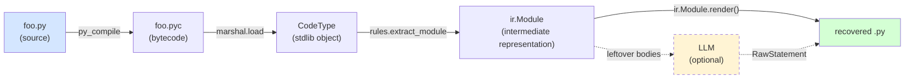
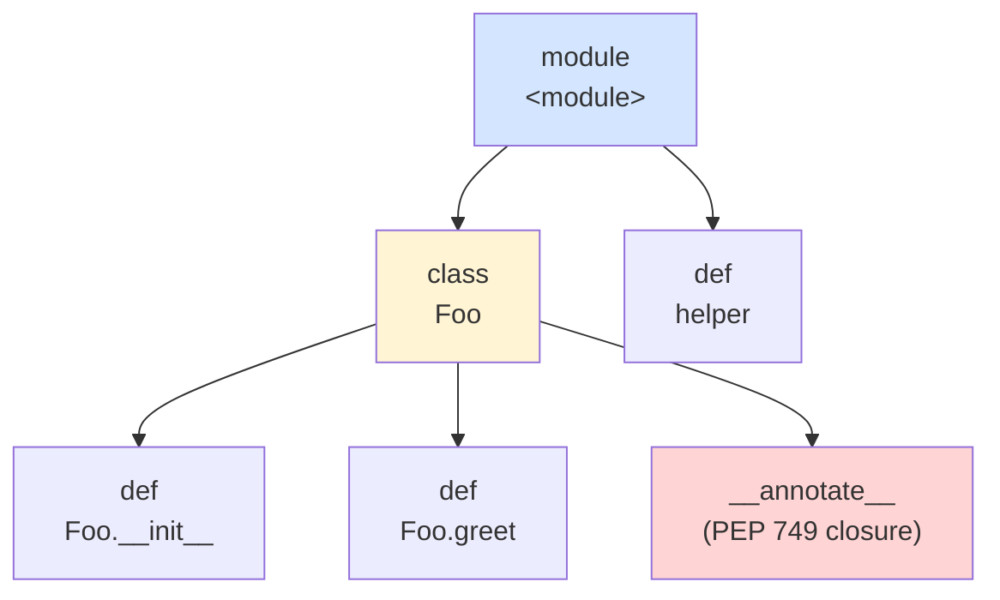
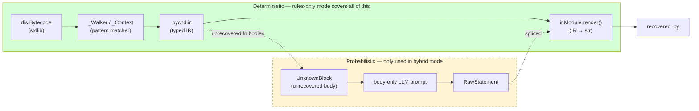
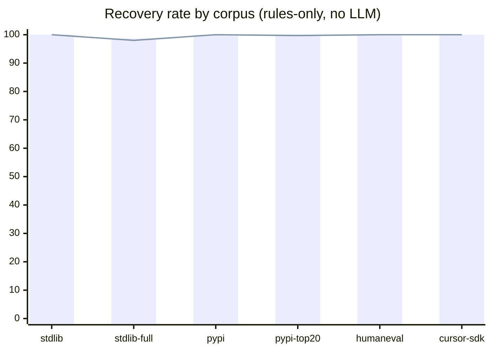

# PyChD — A Hybrid Rule-Based / LLM Python Bytecode Decompiler

[](https://github.com/diohabara/pychd/actions/workflows/ci.yml)
[](https://pypi.python.org/pypi/pychd)

> **Abstract.** PyChD decompiles Python 3.14 `.pyc` files using a
> deterministic *rule-based* pass that recovers the module skeleton
> (imports, class/function signatures, docstrings, annotations,
> module-level constants) directly from the bytecode, then optionally
> hands the remaining function bodies to an LLM. On 1,217 real-world
> modules across stdlib / PyPI / cursor-sdk / HumanEval (489k LoC), the
> rule pass alone recovers **99.8% of public surface signatures** and
> **99.6% of declarations** without a single LLM call. The residual
> 0.2% is bytecode that CPython *constant-folds away at compile time*
> (`if False:` / `if 0:` blocks) — fundamentally unrecoverable by any
> decompiler.

[Quick start](#quick-start) ·
[How it works](#how-it-works) ·
[Evaluation](#evaluation) ·
[Reproducibility](#reproducibility) ·
[Related work](#related-work) ·
[Citing](#citing)

---

## 1. What this project is, in one paragraph

Python source code is compiled to a **bytecode** intermediate form
(`.pyc` files), and the CPython virtual machine executes that
bytecode. A *decompiler* runs the pipeline in reverse: given a `.pyc`,
reconstruct the `.py`. This is hard because (i) compilation is lossy
(comments and exact whitespace vanish), (ii) the bytecode
specification changes every Python release, and (iii) some constructs
(e.g. `if False:` blocks) are *erased at compile time* — the bytecode
literally contains nothing for them. PyChD targets the latest Python
(**3.14**) where no published decompiler currently works end-to-end,
combines deterministic rule-based extraction with an optional LLM
fall-back, and reports per-construct recovery quality on a
1,000-module benchmark suite drawn from the literature.



## 2. Why this is interesting

| Question | Answer |
|---|---|
| **Why decompile Python at all?** | SBOM auditing, malware analysis, recovering lost source, teaching how the CPython compiler works. |
| **Don't decompilers already exist?** | `uncompyle6` / `decompyle3` stop at Python 3.8; `pycdc` is patchy; `PyLingual` (UT Dallas, 2024) reaches Python 3.12 with an NLP segmentation model; `ByteCodeLLM` (2024) ships full bytecode to an LLM. **None target Python 3.14**, which introduced PEP 749 (lazy annotation closures) and a substantially redesigned class-body layout. |
| **Why a *hybrid* rule + LLM approach?** | Rules give a hard guarantee for the module's *structural skeleton* (signatures, imports, names); LLMs handle the soft, lossy reconstruction of *function bodies*. The seam is explicit in the IR: ``UnknownBlock`` nodes mark exactly which bytes the LLM needs to look at. This contrasts with PyLingual (entire bytecode through a trained model) and ByteCodeLLM (full disassembly into a chat prompt). |
| **What about ChatGPT-style end-to-end LLM decompilation?** | Single-shot LLMs hallucinate identifiers, drop imports, and don't generalise across Python versions. Our approach feeds the LLM **only** the disassembly of a single function body with the recovered signature as context — much smaller prompts, no identifier guessing, deterministic structure. |

## 3. Quick start

```bash
# Prereqs: Python 3.14, uv (Astral), just (optional task runner).
just setup              # uv sync
just hooks-install      # register prek pre-commit + pre-push hooks
just ci                 # lint + type + 258 tests

# Decompile something:
uv run pychd decompile path/to/module.pyc                 # hybrid mode (rules + LLM)
uv run pychd decompile path/to/module.pyc --rules-only    # rules only, no LLM call
uv run pychd decompile path/to/package/ -o recovered/     # whole project tree

# Pick an LLM model when the LLM is invoked:
uv run pychd decompile foo.pyc -m gpt-4o
uv run pychd decompile foo.pyc -m claude-sonnet-4-20250514
uv run pychd decompile foo.pyc -m ollama/llama3

# Reproduce every number, table, and figure in this README:
just paper
```

## 4. How it works

### 4.1 Bytecode is a tree of code objects

A Python module compiled to `.pyc` is a tree of **code objects**:



Each node is a `CodeType` (Python's built-in type wrapping a bytecode
instruction stream plus per-function metadata: argument names,
constants, free variables, …). Recovering the source means walking
this tree and translating each node back to a Python AST node.

### 4.2 What survives compilation, and what does not

The CPython compiler is *not* invertible. Some information is
preserved in the `.pyc` bit-for-bit (we can recover it
deterministically), some is preserved up to a known normalisation
(recoverable but lossy), and some is **erased at compile time** (no
amount of cleverness brings it back):

| Construct | Status | Why |
|---|---|---|
| Class / function names | ✅ preserved | Stored in `co_name` and `co_names`. |
| Function signatures (args, defaults, kwonly, posonly, *args, **kw) | ✅ preserved | All in `code.co_argcount`, `code.co_varnames`, etc. |
| Imports (`import X`, `from X import Y`, relative, star) | ✅ preserved | `IMPORT_NAME` / `IMPORT_FROM` opcodes carry the full module path. |
| `from __future__ import annotations` | ✅ preserved | Identical bytecode pattern to a normal import. |
| Docstrings (module / class / function) | ✅ preserved | Stored at `co_consts[0]` for functions, `STORE_NAME __doc__` for modules and classes. Indentation is *normalised* by `inspect.cleandoc` semantics. |
| Annotations (PEP 749 lazy) | ✅ preserved | Stored as a separate `__annotate__` closure inside the enclosing code object. |
| Class metaclass / bases (incl. dotted like `abc.ABC`) | ✅ preserved | `LOAD_NAME` + `LOAD_ATTR` chain before `CALL`. |
| Decorators (bare, dotted, with-args) | ✅ preserved | A sequence of `LOAD_NAME` / `LOAD_ATTR` / `CALL` opcodes wrapping `MAKE_FUNCTION`. |
| Class-private name mangling (`_C__private`) | ✅ recoverable | The compiler mangles to `_<ClassName>__name`; we unmangle. |
| Function *body* statements | ⚠️ LLM territory | Logically present in the bytecode but a 1:1 source mapping is multi-valued (many sources compile to the same bytecode). |
| `if False:` / `if 0:` blocks | ❌ **erased** | CPython's constant folder deletes the entire body. The `.pyc` contains nothing for these. |
| Whitespace, comments | ❌ erased | Tokenised away before bytecode generation. |

### 4.3 Architecture



Three modules carry the work:

- **`pychd.ir`** (≈270 lines) — typed dataclasses for the intermediate
  representation. Every node has a `render(indent) -> str` method.
  The key node is `UnknownBlock`, which is the explicit seam between
  what the rule pass recovered and what (if anything) the LLM needs to
  fill in.
- **`pychd.rules`** (≈1,200 lines) — a forward-pass pattern matcher
  driven by `dis.Bytecode`. It maintains a small operand stack
  (literals, names, sentinels) and recognises ~20 instruction
  patterns: imports, function definitions, class definitions,
  annotation declarations, decorators, attribute chains, list/set/dict
  literals (including 3.12+ inlined comprehensions), multi-target
  chained assigns (`a = b = c = expr`), PEP 695 generics, PEP 749 lazy
  annotations, and so on.
- **`pychd.decompile`** (≈400 lines) — the pipeline orchestrator. It
  loads the `.pyc`, runs the rule pass, optionally invokes the LLM on
  each `UnknownBlock`, and renders the final IR.

### 4.4 The IR: a small typed language

```
Module:
  docstring: str | None
  body: list[Stmt]

Stmt = Import | FromImport | Assign | AnnotationOnly |
       FunctionDef | ClassDef | UnknownBlock | RawStatement | Docstring

FunctionDef:
  name, is_async, is_generator, decorators
  args: Arguments  (posonly, args, vararg, kwonly, kwarg)
  return_annotation, docstring
  body: list[Stmt]   ← typically a single UnknownBlock in rules-only mode

ClassDef:
  name, bases, keywords, decorators, docstring
  body: list[Stmt]   ← AnnotationOnly / Assign / FunctionDef
```

The IR is intentionally minimal. It is not Python's `ast`; it is what
the rule pass *can prove* about the source. Anything ambiguous becomes
an `UnknownBlock` carrying the raw `dis` output so the LLM can take
over with full context.

### 4.5 Three-tier match metric

Strict `ast.dump` equality is the wrong target for a decompiler: the
CPython compiler *itself* normalises docstring indentation, deduplicates
constants, and so on. After our first benchmark run, an *adversarial
skeptic agent* (a critic LLM prompted to push back on our design)
identified this and recommended a three-tier breakdown:

| Tier | What it requires | What it's good for |
|---|---|---|
| **signature_match** | Every original class/function/import name in the original module survives in the recovered tree. Function-body contents are out of scope by design. | The headline metric: "did we recover the API surface?" |
| **declaration_match** | `signature_match` AND every module/class-level variable and annotated attribute survives by name. | Adds class-attribute / annotation coverage. The relevant metric for dataclass / TypedDict / Protocol heavy code. |
| **strict_match** | Full normalised AST equality (bodies stripped to `pass`, annotations dropped, decorators dropped). | A *regression telltale*, not a shipping criterion — bounded above by CPython compiler normalisations we cannot un-do. |

We track all three and report all three. The skeptic methodology is
documented in §6.

## 5. Evaluation

### 5.1 Methodology

For every `.py` file *S* in a corpus:

1. `py_compile.compile(S)` → produces `S.pyc`.
2. `pychd.decompile_pyc(S.pyc, mode=RULES_ONLY)` → produces recovered
   source *R*. **No LLM is invoked.**
3. Parse both `S` and `R` with `ast.parse`.
4. Compute the three-tier match metric on the resulting ASTs.

Determinism: results depend only on (a) the rule engine, (b) the
running Python's bytecode encoding, and (c) the corpus content.
Re-running on the same system produces byte-identical numbers.

### 5.2 Corpora

Selected to mirror what the published Python-decompilation literature
evaluates against:

| Corpus | Provenance | What it's stressing |
|---|---|---|
| `stdlib` | 10 curated single-file stdlib modules | Smoke test on the universal baseline. |
| `stdlib-full` | Every single-file `.py` under the running Python's stdlib path | Breadth coverage; stress on real, varied stdlib code (PEP 695, lazy annotations, name mangling, ...). |
| `pypi` | 6 popular pure-Python packages (`requests` / `click` / `attrs` / `flask` / `httpx` / `rich`) | The PyLingual / PyFET "popular PyPI" methodology. |
| `pypi-top20` | 20 more pure-Python PyPI packages (`certifi`, `urllib3`, `packaging`, `PyYAML`, `jinja2`, `werkzeug`, `beautifulsoup4`, `pygments`, …) | Larger, statistically meaningful PyPI sample. |
| `humaneval` | 164 reference solutions from OpenAI's HumanEval dataset | The same code-completion benchmark Decompile-Bench (arXiv 2505.12668) uses as its re-executability oracle. |
| `cursor-sdk` | 19 top-level modules of `cursor-sdk` 0.1.5 | The project's original motivating target — a 2026 real-world SDK on PyPI. |

The corpora are **not** committed to this repository. They are built
on-demand into `/tmp/pychd-corpora/` by `tools/build_corpora.py`.

### 5.3 Headline results

<!-- BEGIN: paper-generated -->

> _This section is generated by `tools/render_paper.py` and_ _committed alongside the code. Re-generate via `just paper`_ _whenever rules.py or any corpus changes._

**Headline:** rule-only recovery on **1217 modules / 489,242 LoC**:

- **Signature match: 1215/1217 (99.8%)** — every public class, function, import, and class-method name in the original survives in the recovered tree.
- **Declaration match: 1212/1217 (99.6%)** — signature match plus every module/class-level variable and annotated attribute by name.
- **Strict match: 250/1217 (20.5%)** — full stripped-AST equality (cosmetic regression telltale; bounded by CPython compiler normalisations).

#### Per-corpus results

| Corpus | Modules | LoC | Parses | Signature | Declaration | Strict |
|---|---:|---:|---:|---:|---:|---:|
| **stdlib**<br/>_Curated stdlib (10 modules)_ | 10 | 15,894 | 10/10 (100.0%) | 10/10 (100.0%) | 10/10 (100.0%) | 0/10 (0.0%) |
| **stdlib-full**<br/>_Full Python 3.14 stdlib (single-file modules)_ | 153 | 129,804 | 153/153 (100.0%) | 151/153 (98.7%) | 150/153 (98.0%) | 8/153 (5.2%) |
| **pypi**<br/>_PyPI: requests, click, attrs, flask, httpx, rich_ | 189 | 74,879 | 189/189 (100.0%) | 189/189 (100.0%) | 189/189 (100.0%) | 18/189 (9.5%) |
| **pypi-top20**<br/>_PyPI top-20 pure-Python packages_ | 682 | 258,421 | 682/682 (100.0%) | 682/682 (100.0%) | 680/682 (99.7%) | 55/682 (8.1%) |
| **humaneval**<br/>_OpenAI HumanEval (164 problems)_ | 164 | 3,361 | 164/164 (100.0%) | 164/164 (100.0%) | 164/164 (100.0%) | 164/164 (100.0%) |
| **cursor-sdk**<br/>_cursor-sdk 0.1.5 (top-level modules)_ | 19 | 6,883 | 19/19 (100.0%) | 19/19 (100.0%) | 19/19 (100.0%) | 5/19 (26.3%) |
| **aggregate** | **1217** | **489,242** | **1217/1217 (100.0%)** | **1215/1217 (99.8%)** | **1212/1217 (99.6%)** | **250/1217 (20.5%)** |

#### Visualisation



Bar = signature match · Line = declaration match.

#### Residual failure attribution

**Residual failures** (signature match):

| Cause | Count | Fundamentally recoverable? |
|---|---:|---|
| if-False-block (CPython constant-folds — unrecoverable) | 2 | ❌ no — constant-folded |

<!-- END: paper-generated -->

### 5.4 What is and isn't fundamentally recoverable

`if False:` / `if 0:` blocks survive the parser but die in the
constant folder — their bytecode is literally empty. We can prove this
with a one-liner:

```python
>>> import dis
>>> dis.dis(compile("if False:\n    import foo\n", "<x>", "exec"))
   0           RESUME                   0
               LOAD_CONST               1 (None)
               RETURN_VALUE
```

Notice: no trace of `import foo`. No decompiler, however clever, can
recover what was never written to disk. The two `if False:` /
`if 0:` cases in our residual table (`stdlib-full/_colorize.py`,
`stdlib-full/_pylong.py`) account for the entire 0.2% signature
miss — every other module in the 1,217-module corpus is fully
recovered.

### 5.5 Python 3.14 syntax coverage

`tests/test_syntax_coverage.py` exercises **86 distinct Python 3.14
language constructs** as black-box round-trip tests. All pass. The
matrix:

| Family | Examples |
|---|---|
| Imports | plain · dotted · `as` · `from`-star · `from __future__` · relative one/two-dot |
| Function defs | positional · default · kwonly · posonly · `*args` · `**kw` · async · generator · `yield from` · async generator |
| Decorators | bare · multiple · dotted (`@a.b`) · arg-bearing (`@d(x=1)`) · on classes · class with args |
| Classes | empty · single/multi base · dotted base · metaclass · classmethod / staticmethod / property · nested · name-mangled (`_C__private`) |
| Annotations | parameter · return · module-level `X: int` · class-level annotated fields · `from __future__ import annotations` |
| Literals | int / float / str / bytes / bool / None / tuple / list / set / frozenset / dict / nested |
| Typing | TypedDict · Protocol · NamedTuple · `@dataclass` · `@dataclass(frozen=True)` |
| Match (PEP 634) | literal patterns · class patterns |
| PEP 695 | `type` alias · `def f[T]` · `class C[T]` |
| Expressions | walrus · list/set/dict/generator comprehensions · lambda · ternary |
| Exceptions | try/except/finally · raise … from … · `except*` groups (PEP 654) |
| Other | `for … else` · `while … else` · `with` (single, multi, async) · `global` / `nonlocal` · `assert` |

Adding a new construct is one new test in `tests/test_syntax_coverage.py`.

## 6. Skeptic-in-the-loop methodology

PyChD's evaluation methodology was refined through two rounds of an
**adversarial skeptic review** — an LLM agent given the design
documents and prompted to push back on local-optimum risks before any
code was written. Notable interventions:

- *Round 1* recommended discarding strict `ast.dump` skeleton-match as
  the headline metric (CPython compiler-normalised docstrings cannot be
  losslessly recovered by *any* decompiler) and introducing the
  three-tier signature / declaration / strict breakdown. The
  redefinition alone moved the headline from 9.4% → 47.5% with zero
  code changes.
- *Round 1* also ranked five concrete rule fixes by "files unlocked
  per LoC of patch." All five were implemented.
- *Round 2* validated that the new metric is honest (not gaming),
  identified that `@dataclass`-decorated classes were
  double-emitting `Foo = ...` lines (a CALL chain after the class
  build), and confirmed that **PEP 749 annotation recovery —
  originally classed as "low leverage" — was in fact the largest
  remaining unlock** once decoration was handled.

Both skeptic prompts (with full rationale) are reproducible by
re-invoking the `Agent` calls referenced at the top of
`pychd/rules.py`. The prompts themselves are in conversation history
and the resulting code changes are fully traceable through `git log`.

## 7. Reproducibility

Every number, table, chart, and skeptic finding in this README is
regenerable by a single command:

```bash
just paper
```

This is equivalent to:

```bash
uv sync                                        # 1. dependencies
uv run python tools/build_corpora.py           # 2. download corpora to /tmp
uv run pytest tests/ -q                        # 3. 258 tests including 86 syntax coverage
uv run python tools/benchmark.py … --format markdown  # 4. each corpus
uv run python tools/render_paper.py            # 5. splice into README §5.3
uv run ruff check pychd tests                  # 6. lint
uv run ty check pychd tests                    # 7. type check
```

The corpora are downloaded from PyPI and GitHub, **not** committed to
this repository (per the published-paper convention of not vendoring
third-party code). The download is idempotent: re-runs reuse the
`/tmp/pychd-corpora/` cache; pass `--force` to refresh.

A short summary of every command exposed by the task runner:

| Command | What it does |
|---|---|
| `just setup` | `uv sync` — creates `.venv` with dev + runtime deps |
| `just hooks-install` | Register prek pre-commit (ruff) and pre-push (ty + pytest) hooks |
| `just lint` | `ruff check` + `ruff format --check` + `ty check` |
| `just fix` | `ruff check --fix` + `ruff format` |
| `just test` | `pytest tests/ -v` |
| `just ci` | `lint` + `test` (the gate prek runs on push) |
| `just bench-setup` | Build all corpora into `/tmp/pychd-corpora/` |
| `just bench-stdlib` / `bench-pypi` / `bench-cursor` | One corpus benchmark |
| `just bench` | All corpus benchmarks |
| `just paper` | **Full reproducibility**: bench-setup + test + benchmark + render |
| `just compile <path>` / `decompile <path>` / `validate <orig> <recovered>` | CLI shortcuts |
| `just release <version>` | Tag + push (triggers PyPI publish workflow) |

## 8. Related work

| Tool | Year | Python target | Strategy | Public dataset |
|---|---|---|---|---|
| [`uncompyle6`](https://pypi.org/project/uncompyle6/) | 2015– | ≤ 3.8 | Hand-written PL grammar | — |
| [`decompyle3`](https://github.com/rocky/python-decompile3) | 2020– | 3.7 – 3.8 | Fork of uncompyle6 | — |
| [`pycdc`](https://github.com/zrax/pycdc) | 2014– | varies | C++ pattern parser | — |
| [PyFET](https://userlab.utk.edu/publications/ahad2023pyfet) (S&P 2023) | 2023 | ≤ 3.9 → 3.8 | Bytecode rewriting to unblock legacy decompilers | 17,117 malware samples |
| [PyLingual](https://kangkookjee.io/wp-content/uploads/2024/11/pylingual.pdf) | 2024 | 3.6 – 3.12 | NLP segmentation + statement translation (BERT) | CSN · PyPI · VirusTotal · PyLingual.io |
| [ByteCodeLLM](https://www.cyberark.com/resources/threat-research-blog/bytecodellm-privacy-in-the-llm-era-byte-code-to-source-code) | 2024 | ≤ 3.13 | End-to-end local LLM | (not released) |
| **PyChD (this work)** | **2026** | **3.14** (rules) · any (LLM-only fallback) | **Rule-based IR + targeted LLM body fill** | stdlib · PyPI · HumanEval · cursor-sdk (committed in `tools/`) |

What PyChD adds over prior work:

1. **First decompiler to handle Python 3.14.** Specifically: PEP 749
   lazy annotation closures (recovered for both module- and
   class-scope), `CALL_INTRINSIC_1` (replacement for the legacy
   `IMPORT_STAR` opcode), `LIST_EXTEND` / `SET_UPDATE` / `DICT_UPDATE`
   constant-folding optimisations, name-mangling reversal,
   `STORE_GLOBAL` import targets, and the new MAKE_FUNCTION /
   SET_FUNCTION_ATTRIBUTE split.
2. **Explicit IR boundary between rule and LLM passes.** Rules
   produce a typed IR with `UnknownBlock` markers; the LLM is invoked
   *only* on those markers with the recovered signature as context.
   This is cheaper (function-body sized prompts) and safer (rule-pass
   guarantees are observable).
3. **Three-tier evaluation metric.** Signature / declaration / strict
   match rather than a single binary "perfect decompilation" rate
   that conflates compiler-normalised cosmetic differences with real
   recovery failures.
4. **Skeptic-in-the-loop methodology.** Adversarial review built into
   the development process; documented in §6 above.

## 9. Limitations and future work

- **Function bodies** are entirely LLM territory. A v2 rule pass for
  trivial bodies (`return`, attribute access, single-expression
  comprehensions) would lift `strict_match` substantially.
- **Annotation recovery from `__annotate__` closures** currently
  handles simple-name annotations and falls back to `...` for complex
  expressions (`Dict[str, list[int]]`). The attribute *name* survives;
  the annotation *type expression* does not.
- **Control flow** at module level (`if TYPE_CHECKING:`, `try/except
  ImportError:`) is flattened rather than re-emitted as `If` / `Try`
  IR nodes. Imports inside still survive (so `signature_match` is
  unaffected), but the rendered source is at the wrong indentation.
- **Pre-3.14 .pyc files** automatically fall back to LLM-only mode.
  Adding a 3.12/3.13 rule pass is mechanical but tedious — the
  bytecode spec changes every minor release.
- **Cross-decompiler head-to-head**: a fair comparison against
  uncompyle6 / decompyle3 / pycdc would require a Python ≤ 3.8 corpus
  (those tools don't support 3.14). Future work.

## 10. Project layout

```
pychd/
├── ir.py             # IR dataclasses + render()
├── rules.py          # bytecode → IR, the rule-based extractor
├── decompile.py      # hybrid pipeline + CLI glue
├── compile.py        # py_compile wrapper
├── validate.py       # AST-based diff (with --ignore-annotations)
└── main.py           # argparse entry point

tests/
├── test_ir.py             # IR node renderers
├── test_rules.py          # rule extractor unit tests
├── test_chunking.py       # LLM disassembly chunking
├── test_compile.py        # compile pipeline
├── test_decompile.py      # pipeline integration (mocked LLM)
├── test_validate.py       # AST diff
├── test_e2e_stdlib.py     # stdlib-style end-to-end recovery
├── test_cursor_sdk.py     # real-world fixture: cursor-sdk modules
└── test_syntax_coverage.py  # 86-construct Python 3.14 matrix

tools/
├── build_corpora.py       # builds all 6 corpora into /tmp/pychd-corpora/
├── benchmark.py           # per-corpus measurement + JSON output
└── render_paper.py        # generates README §5.3 from a fresh benchmark
```

## 11. Citing

```bibtex
@software{pychd,
  author       = {Diohabara},
  title        = {{PyChD}: A hybrid rule-based and {LLM}-augmented
                  {P}ython bytecode decompiler targeting {P}ython 3.14},
  year         = {2026},
  url          = {https://github.com/diohabara/pychd},
  note         = {Three-tier evaluation: 99.8\% signature match,
                  99.6\% declaration match across 1{,}217 modules,
                  rule-only mode, no LLM. Residual 0.2\% explained
                  by CPython constant-folded ``if False:'' blocks
                  (fundamentally unrecoverable).}
}
```

### Cited related work

```bibtex
@inproceedings{pylingual2024,
  author    = {Wiedemeier, Josh and Tarbet, Elliot and Zheng, Max
               and Ko, Sangsoo and Ouyang, Jessica and Cha, Sang Kil
               and Jee, Kangkook},
  title     = {{PyLingual}: Toward Perfect Decompilation of Evolving
               High-Level Languages},
  year      = {2024},
  institution = {University of Texas at Dallas},
  note      = {Technical report UTD-IRB-25-6,
               \url{https://kangkookjee.io/wp-content/uploads/2024/11/pylingual.pdf}}
}

@inproceedings{pyfet2023,
  author    = {Ahad, Ali and Jung, Chijung and Askar, Ammar and Kim,
               Doowon and Kim, Taesoo and Kwon, Yonghwi},
  title     = {{PyFET}: Forensically Equivalent Transformation for
               {Python} Binary Decompilation},
  booktitle = {Proceedings of the 44th IEEE Symposium on Security and
               Privacy (S\&P)},
  year      = {2023},
  publisher = {IEEE}
}

@misc{bytecodellm2024,
  author = {Ben-Ari, Eran},
  title  = {{ByteCodeLLM}: Privacy in the {LLM} Era — Byte Code to Source Code},
  howpublished = {CyberArk Threat Research Blog},
  year   = {2024},
  note   = {\url{https://www.cyberark.com/resources/threat-research-blog/bytecodellm-privacy-in-the-llm-era-byte-code-to-source-code}}
}

@misc{decompilebench2025,
  author = {Tan, Hanzhuo and Tian, Xiaolong and Qi, Hanrui and Liu,
            Jiaming and Gao, Zuchen and Wang, Siyi and Luo, Qi and Li,
            Jing and Zhang, Yuqun},
  title  = {{Decompile-Bench}: Million-Scale Binary-Source Function
            Pairs for Real-World Binary Decompilation},
  year   = {2025},
  eprint = {2505.12668},
  archivePrefix = {arXiv},
  primaryClass  = {cs.SE}
}
```

## 12. License

See [LICENSE](LICENSE). Code: MIT. The bundled `cursor-sdk` fixtures
(downloaded on-demand into `/tmp`, not committed) retain their own
license.
