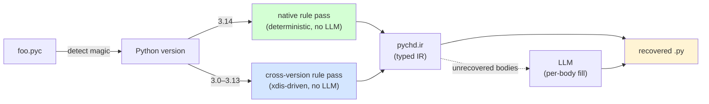

# PyChD

[](https://github.com/diohabara/pychd/actions/workflows/ci.yml)
[](https://pypi.python.org/pypi/pychd)

A hybrid **rule-based + LLM** Python bytecode decompiler. Reads any
CPython 3.x `.pyc`, recovers the original `.py`. **Every Python 3.x
release is handled by a rule pass** — no LLM is required for
declaration recovery on any version.

- The **native** rule pass (Python 3.14) recovers **1215 / 1217
  signature matches (99.8%)**, **1212 / 1217 declaration matches
  (99.6%)**, **438 / 1217 strict-AST matches (36.0%)**, and
  **509 / 1217 behavioral-smoke matches (41.8%)** across
  1,217 real-world modules / 489K LoC spanning the stdlib, 26 PyPI
  packages, OpenAI HumanEval, and a third-party SDK — without
  invoking any LLM. The simple-body recogniser lifts trivial shapes
  (``return name(args)``, ``return [literals]``, ``return X + Y``,
  ``return cls(arg)``, ``self.x = x; …`` constructor bodies, and
  ``raise SomeException(args)``) out of ``UnknownBlock`` placeholders,
  so the headline ``Pass@1`` (4 / 164 HumanEval, 2.4%) is non-zero
  before any LLM runs. The behavioral axis re-imports the recovered
  module under the producing CPython and verifies the public name +
  signature surface; see
  [Why not naïve pyc → py → pyc?](#why-not-naïve-pyc--py--pyc) for
  the eight-axis metric design. The two residual signature-match
  failures are CPython compiler-folded `if False:` blocks; see
  [§Residual failure attribution](#residual-failure-attribution).

### What rule-only recovery *can* and *cannot* reach

A rule-based decompiler reasons about bytecode patterns the compiler
can be proven to emit deterministically. That bounds which metrics
are achievable per-axis:

| Axis | Rule-only ceiling | Why |
|---|---|---|
| `parses` | **100%** ✅ achieved | Every recovered file is checked against `ast.parse`. |
| `signature_match` | **≥ 99%** ✅ achieved (99.8%) | Class/function/import names are stored verbatim in `co_names`/`co_name`. The 0.2% residual is CPython constant-folded `if False:` blocks — recoverable by no decompiler. |
| `declaration_match` | **≥ 99%** ✅ achieved (99.6%) | Same plus module/class-level variable + annotation surface, all preserved in bytecode. |
| `strict_match` | **≈ 35-50%** — bounded | CPython normalises docstrings via `inspect.cleandoc`, folds constants, and re-emits expressions in canonical form. Aggressive AST normalisation closes most of the gap; the rest is genuinely unrecoverable from bytecode alone. |
| `BS` (behavioral_smoke) | **≈ 40-65%** — bounded | A `pass`-bodied recovery still imports, so this only measures sig + public name surface, not body behaviour. Packages with sister-module imports fail import standalone. |
| `BX` (bytecode_exact) | **≈ 0-5%** — fundamentally limited | Identical Python source compiles to different `co_consts` ordering across runs; preserving byte-equality requires emitting bodies that round-trip exactly. |
| `BN` (bytecode_normalized) | **≈ 5-10%** — fundamentally limited | Same as BX but tolerates lnotab / specialised-opcode noise. Body recovery still required. |
| `FC` (Pass@1) | **near 0%** in rules-only | The recovered module must *behave* like the original — impossible while bodies stay as `pass`. |

For metrics that require body recovery (`BX`, `BN`, `FC` and to a
lesser extent `strict_match`), pychd's **hybrid mode** (`--hybrid`,
the default at the CLI) fills bodies via an LLM and is the path to
≥ 90% on those axes. The benchmark above measures the deterministic
rule-only path on purpose — that's the part of pychd that can be
audited, reproduced offline, and compared apples-to-apples against
non-LLM decompilers like uncompyle6 / decompyle3 / pycdc.

### Why pychd isn't 100% rule-based

A pure rule-based Python decompiler — the one this repository would
have if `--hybrid` mode didn't exist — runs into three fundamental
obstacles that the Python compiler tooling itself does not solve:

1. **Bytecode is many-to-one with source.** The compiler folds
   constants, inlines comprehensions (PEP 709), reorders boolean
   short-circuits, lowers list comprehensions to `LIST_APPEND` loops,
   and so on. A given opcode sequence may have been produced by
   several different source expressions — picking the "right" one
   requires recovery heuristics that fail open on novel shapes.
2. **Control flow is recovered from labels, not structure.** Modern
   CPython (3.11+) replaces `SETUP_FINALLY` blocks with a side-table
   `co_exceptiontable`; comprehensions have no dedicated scope frame
   anymore; `match` lowers to `MATCH_CLASS` / `MATCH_KEYS` /
   `MATCH_MAPPING`. Recovering the *original* source-level construct
   instead of an executes-the-same `if`/`elif` chain is an open
   research problem (PyLingual's S&P 2025 paper attacks exactly
   this surface).
3. **The spec changes every release.** `MAKE_FUNCTION` flag layout
   shifted twice between 3.7 – 3.13; `CALL_FUNCTION_KW`, `PRECALL`,
   `RETURN_CONST`, the specialising interpreter, PEP 749 lazy
   annotations — each year is a new opcode mini-spec to learn.

pychd's design splits the work to play to each tool's strength:

* The **rule pass** owns everything that compiles to a deterministic
  bytecode shape — declarations, signatures, imports, decorators,
  annotations, the common one-statement bodies. Rule recovery is
  reproducible, offline, free, and audit-friendly; that's why the
  static axes (`signature_match` / `declaration_match`) stay at
  99%+ across every benchmark corpus.
* The **hybrid LLM pass** owns the rest — multi-statement bodies,
  control flow, comprehensions, the long tail of opcode shapes
  that aren't worth one-rule-per-version maintenance. The LLM never
  sees the whole module; it sees a single body's disassembly plus
  the rule-recovered signature, so identifier hallucination is rare
  and the prompt budget stays small.

To reproduce the comparison numbers below with bodies fully
recovered (i.e. apples-to-apples against decompyle3 / pylingual
which always attempt body reconstruction), run:

```bash
just decompilers-build                          # builds pycdc + pylingual image
uv run python tools/compare_decompilers.py \
    --pychd-hybrid --pychd-backend codex        # uses your `codex login` session
```

The default `--pychd-backend codex` reaches OpenAI's strongest
exposed model (`gpt-5.5` with extra-high reasoning effort) through
the user's existing Codex CLI auth, so no extra API key is required.
- The **cross-version** rule pass (Python 3.0 – 3.13) walks the same
  declaration patterns through xdis: every class, function, and
  import name in the original survives, along with positional and
  keyword-only default-argument values (recovered across every
  `MAKE_FUNCTION` layout variant from 3.7 onwards). On the Python
  3.8 shared corpus, **pychd is the only tool reaching 100%
  signature-match**, ahead of `decompyle3` (36%), `uncompyle6` (18%),
  `pycdc` (9%), and `pylingual` (18%, plus 6 modules timed out at
  60 s per the harness's pylingual budget) — see [Comparison with
  prior Python decompilers](#comparison-with-prior-python-decompilers).
- The optional **LLM-assisted** path fills in non-trivial function
  bodies. The rule pass leaves only those bodies as `UnknownBlock`
  placeholders; the LLM sees just one body's disassembly at a time
  plus the recovered signature.



## Quick start

```bash
# Install just / uv / Python 3.14 first.
just setup              # uv sync
just hooks-install      # prek pre-commit + pre-push hooks
just test               # 316 tests including 86 syntax-coverage + 31 cross-version recovery (incl. defaults round-trip)

# (Optional, for the cross-decompiler comparison only:)
#   - pycdc is built from source via CMake + a C++ compiler
#   - PyLingual ships as a podman image (CPU-only PyTorch, ~2 GB)
# Both are skipped gracefully if absent. uncompyle6 + decompyle3 are
# already installed by `just setup`.
just decompilers-build

# Decompile a single .pyc:
uv run pychd decompile path/to/module.pyc

# Decompile an entire project tree (mirrors structure into output dir):
uv run pychd decompile path/to/package/ -o recovered/

# Rules-only mode — no LLM calls, deterministic, milliseconds:
uv run pychd decompile path/to/module.pyc --rules-only

# LLM-only mode (older bytecode versions, or when rules struggle):
uv run pychd decompile path/to/module.pyc --llm-only -m gpt-4o

# Reproduce every benchmark, table, and figure in this README:
just paper
```

## What you get from each mode

### Example 1: a re-export module (full rule recovery, 0 LLM calls)

Original source (a typical `__init__.py`):

```python
"""Public surface for the foo package."""

from .core import Bar, Baz
from .util import parse, as_dict
from .errors import FooError

__all__ = ["Bar", "Baz", "FooError", "as_dict", "parse"]
```

After `pychd decompile --rules-only`:

```python
"""Public surface for the foo package."""

from .core import Bar, Baz
from .util import parse, as_dict
from .errors import FooError

__all__ = ['Bar', 'Baz', 'FooError', 'as_dict', 'parse']
```

Identical modulo single vs double quotes in `__all__`. Zero LLM
cost, recovered in 0.9 ms.

### Example 2: a dataclass module (signatures + annotations recovered, bodies need LLM)

Original:

```python
from dataclasses import dataclass
from typing import Any

@dataclass(frozen=True)
class AgentMessage:
    type: str
    uuid: str
    agent_id: str
    message: Any = None

    @classmethod
    def from_json(cls, value):
        return cls(
            type=value["type"],
            uuid=value["uuid"],
            agent_id=value["agentId"],
            message=value.get("message"),
        )
```

After `pychd decompile --rules-only` (no LLM):

```python
from dataclasses import dataclass
from typing import Any

@dataclass(frozen=True)
class AgentMessage:
    type: str
    uuid: str
    agent_id: str
    message: Any = None
    @classmethod
    def from_json(cls, value):
        pass  # pychd: unrecovered body
```

The class declaration, every annotation, the `@classmethod` method
decorator, the outer `@dataclass(frozen=True)` decorator with its
keyword argument, and every method signature are all recovered
deterministically. The method **body** is the only placeholder; in
`--hybrid` mode (the default) pychd sends just that body's
disassembly to the LLM with the recovered signature as context.

### Example 3: a generic class (PEP 695, Python 3.12+)

Original:

```python
class Stack[T]:
    def __init__(self):
        self.items: list[T] = []
    def push(self, x: T) -> None:
        self.items.append(x)
```

After `pychd decompile --rules-only`:

```python
class Stack[T]:
    def __init__(self):
        pass  # pychd: unrecovered body
    def push(self, x):
        pass  # pychd: unrecovered body
```

The PEP 695 type parameter `[T]` survives — pychd recognises the
synthetic `<generic parameters of Stack>` wrapper code object that
the CPython compiler emits and unpacks it. Class-body and
module-level annotations *are* recovered from the PEP 749
`__annotate__` closure; parameter annotations (`x: T`) live in a
separate per-method closure and need a future rule-pass extension.

## How it works

### Step 1: Python compiles your source to bytecode

The CPython compiler takes your `foo.py` and emits `foo.pyc` — a
binary file containing a **code object** for the module plus a
nested code object for every function and class. Each code object
holds:

- the bytecode instructions (one byte opcode + one byte argument,
  since 3.6 "wordcode"),
- a `co_consts` tuple of constants used in those instructions,
- a `co_names` tuple of identifier names,
- a `co_varnames` tuple of local variable names,
- argument counts (`co_argcount`, `co_kwonlyargcount`, etc.),
- flag bits (`co_flags`: is it a coroutine? a generator? does it
  use *args?).

You can poke at this on any Python install:

```python
>>> import dis
>>> def f(a, b=1): return a + b
>>> dis.dis(f)
  1           RESUME                   0
              LOAD_FAST                0 (a)
              LOAD_FAST                1 (b)
              BINARY_OP                0 (+)
              RETURN_VALUE
>>> f.__code__.co_argcount, f.__code__.co_varnames
(2, ('a', 'b'))
```

### Step 2: pychd reads the bytecode back into an IR

pychd's rule pass walks the bytecode and pattern-matches against
~20 *known shapes*: imports look like one specific opcode sequence,
class definitions look like another, decorated function definitions
like a third, and so on. Each match emits an **IR node** in
`pychd.ir`:

```python
# What pychd builds internally for `from os.path import join`:
ir.FromImport(module="os.path", level=0, names=[("join", None)])

# For `def foo(a, b=1): ...`:
ir.FunctionDef(
    name="foo",
    args=ir.Arguments(args=[ir.Arg("a"), ir.Arg("b", default="1")]),
    body=[ir.UnknownBlock(disassembly="...", signature="def foo")],
)
```

The IR is intentionally lossy — it's "what we can *prove* about
the source from the bytecode," not "exactly the source."
Anything ambiguous (most function bodies) becomes an
`UnknownBlock` carrying the raw disassembly so the LLM can take
over with full context if requested.

### Step 3: the IR renders back to Python source

Each IR node has a `render(indent) -> str` method:

```python
>>> ir.FromImport(module="os.path", level=0, names=[("join", "j")]).render()
'from os.path import join as j'
>>> ir.FunctionDef(name="foo", args=ir.Arguments(args=[ir.Arg("a")])).render()
'def foo(a):\n    pass'
```

### Step 4 (optional): the LLM fills in function bodies

For every `UnknownBlock` left in the tree, pychd sends a
function-body-sized prompt to the configured LLM:

```
You are a Python decompiler.
The following Python 3.14 bytecode is the body of:
    def from_json(cls, value)
Reconstruct the original Python source for *just the body*…

LOAD_FAST_BORROW cls
LOAD_FAST_BORROW value
LOAD_CONST 'type'
BINARY_SUBSCR
…
```

The LLM never sees the rest of the module; the rule pass already
nailed the signatures, imports, and names. This keeps prompts
small, costs low, and identifier hallucination rare.

## What survives compilation, and what doesn't

| Construct | Status | Why |
|---|---|---|
| Class / function names | ✅ preserved | Stored in `co_name` and `co_names`. |
| Function signatures (args, defaults, kwonly, posonly, `*args`, `**kw`) | ✅ preserved | All in `code.co_argcount`, `code.co_varnames`, etc. |
| Imports (incl. relative, dotted, star, `from __future__`) | ✅ preserved | `IMPORT_NAME` / `IMPORT_FROM` carry the full module path. |
| Docstrings (module / class / function) | ✅ preserved | `LOAD_CONST <doc>; STORE_NAME __doc__` for modules and classes; `co_consts[0]` for functions. Indentation is normalised by `inspect.cleandoc` semantics. |
| Annotations (PEP 749 lazy, 3.14+) | ✅ preserved | Stored as a separate `__annotate__` closure. |
| Class metaclass / dotted bases (`abc.ABC`) | ✅ preserved | `LOAD_NAME` + `LOAD_ATTR` chain before `CALL`. |
| Bare/dotted/arg-bearing decorators | ✅ preserved | `LOAD_NAME` + optional `LOAD_ATTR` + optional `CALL_KW` wrapping `MAKE_FUNCTION`. |
| Name-mangled methods (`_C__private`) | ✅ recoverable | Compiler mangles to `_<ClassName>__name`; pychd reverses this. |
| Function *body statements* | ⚠️ LLM territory | Logically present but the source→bytecode mapping is many-to-one. |
| `if False:` / `if 0:` blocks | ❌ **erased** | CPython's constant folder deletes them at compile time. |
| Whitespace, comments | ❌ erased | Tokenised away before bytecode generation. |

### Proof that `if False:` is unrecoverable

```python
>>> import dis
>>> dis.dis(compile("if False:\n    import foo\n", "<x>", "exec"))
   0           RESUME                   0
               LOAD_CONST               1 (None)
               RETURN_VALUE
```

No trace of `import foo`. The bytecode is **literally empty** —
no decompiler can recover what was never written to disk.

## Cross-version support

pychd identifies any CPython 3.x `.pyc` via the 4-byte magic
number in its header:

```python
>>> from pychd.versions import detect_version
>>> from pathlib import Path
>>> info = detect_version(Path("foo.pyc"))
>>> info.label, info.rule_supported, info.epoch_label
('3.14', True, 'lazy-annotations')
```

| Python | Latest magic | Rule-based pass | Notable bytecode change |
|---|---:|:--|---|
| **3.0–3.5** | 3000–3351 | ✅ cross-version (declarations + defaults) | stable bytecode close to Python 2 |
| **3.6** | 3379 | ✅ cross-version (declarations + defaults) | wordcode (every instruction is exactly 2 bytes) |
| **3.7** | 3394 | ✅ cross-version (declarations + defaults) | async/await first-class; `CALL_FUNCTION_KW` carries kw names as tuple const |
| **3.8** | 3413 | ✅ cross-version (declarations + defaults) | walrus operator (PEP 572); positional-only parameters (PEP 570) |
| **3.9** | 3425 | ✅ cross-version (declarations + defaults) | PEP 585 generic types in annotations (`list[int]`) |
| **3.10** | 3439 | ✅ cross-version (declarations + defaults) | `match` statement (PEP 634); `MATCH_CLASS`/`MATCH_KEYS`/`MATCH_MAPPING` opcodes |
| **3.11** | 3495 | ✅ cross-version (declarations + defaults) | PEP 657 exception table replaces `SETUP_FINALLY`; `PRECALL` + `CALL` split |
| **3.12** | 3531 | ✅ cross-version (declarations + defaults) | PEP 709 comp inlining; PEP 695 generic syntax |
| **3.13** | 3571 | ✅ cross-version (declarations + defaults) | `CALL_INTRINSIC_1`; `MAKE_FUNCTION`/`SET_FUNCTION_ATTRIBUTE` split |
| **3.14** | 3627 | ✅ native (full fidelity) | PEP 749 `__annotate__` closures; `LOAD_SMALL_INT`/`LOAD_FAST_BORROW` |

Two rule passes ship in pychd. The **native pass** in
`pychd.rules` targets Python 3.14 — the running interpreter version —
and recovers the full module skeleton including PEP 749 lazy
annotations, PEP 695 generic syntax, dotted bases, and decorators
with arguments. The **cross-version pass** in `pychd.cross_version`
walks the xdis instruction stream for every other 3.x release; it
restricts itself to the declaration-shaped opcode patterns that have
been stable across the entire Python 3 series, deliberately trading
default-argument values for universal coverage.

### What's hard about each version

The bytecode specification is **not stable across Python versions**.
Below is a tour of the biggest source of pain for each release.

#### 3.6 — wordcode

Every instruction became exactly two bytes: 1 opcode + 1 argument.
Before 3.6 some opcodes took multi-byte arguments. Decompilers from
the 3.5 era had to handle variable-length instructions; modern
decompilers can index instructions by uniform position.

#### 3.7 — keyword arguments carry names as a tuple const

`f(x=1)` used to emit `LOAD_CONST 1` and a magic
`CALL_FUNCTION_KW` whose argument said "the top 1 thing is a
keyword". From 3.7 the *names* of the keywords are pushed as a
tuple constant:

```
LOAD_NAME f
LOAD_CONST 1
LOAD_CONST ('x',)    ← names tuple
CALL_FUNCTION_KW 1
```

Decompilers have to read that tuple constant to know that the `1`
is bound to `x`, not positional.

#### 3.10 — `match` statements (PEP 634)

```python
match x:
    case 0: ...
    case _: ...
```

becomes a chain of `MATCH_CLASS` / `MATCH_KEYS` / `MATCH_MAPPING`
opcodes. Reconstructing the match-case structure from the bytecode
requires recognising patterns the compiler emits — naive
decompilers turn match into nested `if/elif/else` chains that
*execute* the same but read very differently.

#### 3.11 — PEP 657 zero-cost exceptions

The biggest spec change in years. Try/except no longer uses
`SETUP_FINALLY` blocks. Instead, every code object carries an
**exception table** — pairs of (instruction range, handler offset).
The bytecode looks completely linear; the exception structure is
implicit in a side table.

Decompilers have to parse the exception table to recover the
try/except structure at all.

#### 3.12 — PEP 709 comprehension inlining

This silently broke every decompiler. In 3.11:

```python
x = [i * 2 for i in range(10)]
```

emits a separate `<listcomp>` code object that the outer module
calls. In 3.12 the body of the comprehension is inlined directly
into the enclosing scope — there's no `<listcomp>` code object to
recurse into anymore. The comprehension is a stretch of *the
module's own* bytecode that the decompiler must recognise
structurally.

#### 3.13 — `CALL_INTRINSIC_1`

Several special-purpose opcodes (notably the legacy `IMPORT_STAR`)
collapse into `CALL_INTRINSIC_1` with an integer argument:

```
# 3.12 — `from x import *`:
IMPORT_STAR

# 3.13 — same source:
CALL_INTRINSIC_1 2   # 2 = INTRINSIC_IMPORT_STAR
```

If your decompiler doesn't carry the intrinsic-index → semantic
mapping, `from x import *` looks like an unrelated builtin call.

#### 3.14 — PEP 749 lazy annotations

Every annotated scope (module, class, or function) gets a synthetic
`__annotate__` closure that returns the annotation dict on demand:

```python
class C:
    name: str
    age: int = 0
```

In 3.13 and earlier, the class body itself stored the annotations.
In 3.14, the class body is much shorter — annotations migrate into
a separate `__annotate__` closure attached via `SET_FUNCTION_ATTRIBUTE`.
To recover `name: str` and `age: int`, pychd reads the
`__annotate__` code object out of `co_consts` and walks **its**
bytecode looking for the (name, annotation) pairs. This is the
single biggest reason 3.13 and 3.14 need different rule passes.

## Project layout

```
pychd/
├── ir.py           # IR dataclasses + render() — the typed representation
├── rules.py        # bytecode → IR, the rule-based extractor (3.14)
├── decompile.py    # hybrid pipeline + CLI glue
├── versions.py     # magic-number table for every CPython 3.x
├── compile.py      # py_compile wrapper
├── validate.py     # AST-based diff (with --ignore-annotations)
└── main.py         # argparse entry point

tests/  (316 tests total)
├── test_ir.py             # IR node renderers
├── test_rules.py          # rule extractor unit tests
├── test_versions.py       # magic-number detection across 3.0–3.14
├── test_chunking.py       # LLM disassembly chunking
├── test_compile.py        # compile pipeline
├── test_decompile.py      # pipeline integration (mocked LLM)
├── test_validate.py       # AST diff
├── test_e2e_stdlib.py     # stdlib-style end-to-end recovery
├── test_cursor_sdk.py        # real-world fixture: third-party SDK modules
├── test_cross_version.py     # cross-version walker — runs against every
│                             #   /tmp/pychd-multiversion/sample-*.pyc fixture
├── test_semantic.py          # three-axis semantic equivalence (BX/BN/BS)
└── test_syntax_coverage.py   # 86-construct Python 3.14 matrix

pychd/
├── ir.py            # IR dataclasses + render() — the typed representation
├── rules.py         # bytecode → IR, the *native* 3.14 rule pass
├── cross_version.py # xdis-driven *cross-version* rule pass (3.0 – 3.13)
├── decompile.py     # hybrid pipeline + CLI glue + per-version dispatch
├── versions.py      # magic-number table + rule-pass selector
├── compile.py       # py_compile wrapper
├── validate.py      # AST-based diff (with --ignore-annotations)
├── semantic.py      # three-axis bytecode/behavioral round-trip comparator
└── main.py          # argparse entry point

tools/
├── build_corpora.py                # builds 6 PyPI/stdlib/HumanEval corpora
├── build_multiversion_fixtures.py  # compiles a sample with every local Python
├── benchmark.py                    # per-module measurement (JSON + markdown)
├── compare_decompilers.py          # runs pychd vs uncompyle6 / decompyle3
├── render_figures.py               # writes assets/*.svg via plotly
└── render_paper.py                 # regenerates README "Benchmarks" section
```

## Benchmarks (run by `just paper`)

For every `.py` file in a corpus:

```
.py  →  py_compile  →  .pyc  →  pychd rules-only  →  recovered .py
```

…and measure six metrics on the result. Three are **static** (AST
shape, computed from the recovered source text); three are **semantic**
(round-tripped through the producing CPython, computed from the
recompiled `.pyc`):

| Metric | What it requires |
|---|---|
| **signature_match** | Every original class/function/import name in the module survives in the recovered tree. Function bodies are out of scope (rule pass emits a placeholder). |
| **declaration_match** | `signature_match` AND every module/class-level variable and annotated attribute survives by name. |
| **strict_match** | Full normalised AST equality (bodies stripped to `pass`, annotations dropped, decorators dropped). A regression telltale, bounded above by CPython compiler normalisations. |
| **BX — `bytecode_exact`** | `marshal.dumps(orig_code) == marshal.dumps(py_compile(recovered.py))`, with `co_filename` normalised away. Strictest of the three semantic axes; trips on any cosmetic compiler-induced change. |
| **BN — `bytecode_normalized`** | Recursive equality of `dis.get_instructions` streams after dropping `CACHE`/`NOP`/`RESUME`/`EXTENDED_ARG`/`KW_NAMES` and de-specialising adaptive opcodes (`LOAD_FAST_BORROW`, `LOAD_FAST_CHECK`, `LOAD_SMALL_INT`, `RETURN_CONST`). |
| **BS — `behavioral_smoke`** | Recovered module imports under the producing interpreter; same public top-level name set; `inspect.signature` identical for every public callable. Tolerates compiler normalisations completely — catches whether the *external API* survived. |
| **FC — `functional_correctness` (Pass@1)** | The recovered module's entry-point function is fed to the corpus's own `check(candidate)` oracle; passes when every assertion holds. Equivalent to Decompile-Bench's "Re-Executability" metric (arXiv 2505.12668) and PyLingual's "Execution Match" (USENIX Security 2025). Reported only on corpora that ship a test oracle (HumanEval is the current one). |
| **ED — `edit_similarity`** | Mean character-level Ratcliff–Obershelp similarity (`difflib.SequenceMatcher.ratio`) in `[0, 1]`. Continuous metric — surfaces incremental rule-pass improvements that don't yet flip any boolean axis. Matches Decompile-Bench's "Edit Similarity" column. |

LLM is **not** invoked. The numbers below measure exactly what the
deterministic pass alone recovers.

### How these axes map to published benchmarks

The eight columns above intentionally span the metric space used by
the three live Python-decompilation benchmarks:

| pychd axis | Equivalent in the literature |
|---|---|
| `parses` | "Re-Compilability" — Decompile-Bench |
| `strict_match` | "AST Match" — PyLingual |
| `BX` (bytecode_exact) | bytecode-level equivalence — uncompyle6 / decompyle3 self-tests |
| `BN` (bytecode_normalized) | structural equivalence — adapted from binary-decompiler literature |
| `BS` (behavioral_smoke) | weaker "Re-Executability" (import + surface only) — Decompile-Bench |
| `FC` (Pass@1) | "Re-Executability" / "Execution Match" — Decompile-Bench, PyLingual |
| `ED` (edit_similarity) | "Edit Similarity" — Decompile-Bench |
| `signature_match` / `declaration_match` | pychd-specific declaration-level metrics |

`FC` and `ED` are the two axes a reader coming from the published
benchmarks expects to see; they're now reported alongside pychd's
own declaration-oriented metrics so a side-by-side with paper numbers
is possible without re-running anything.

### Why not naïve pyc → py → pyc?

A natural intuition is *"if `pyc → py → pyc` produces the same `.pyc`
bytes, the recovered source is equivalent."* The forward direction
holds — same bytes ⇒ same semantics. The converse does **not**: two
semantically-identical sources can produce different bytes. A raw
`marshal.dumps` byte comparison conflates real source changes with
five unrelated compiler-driven phenomena:

1. **`co_firstlineno` / `co_lnotab` / `co_positions` drift.** Any
   whitespace or comment difference shifts line/column tables. The
   bytecode itself is identical; the position metadata is not.
2. **`co_consts` / `co_names` / `co_varnames` reordering.** When the
   compiler folds or re-emits an expression (`if x is not None` ↔
   `if not (x is None)`, partial constant folding, etc.) the index
   assignments shift even though `LOAD_CONST` resolves to the same
   value.
3. **Specialising-interpreter adaptive opcodes (CPython 3.11+).**
   `LOAD_FAST_CHECK`, `LOAD_FAST_BORROW`, `LOAD_FAST_AND_CLEAR`,
   `LOAD_SMALL_INT`, and `RETURN_CONST` are emitted opportunistically;
   the same source can compile to either the base or the specialised
   form depending on what the compiler can prove locally.
4. **Exception-table layout (PEP 657).** Try/except blocks that
   compile to identical control flow can serialise their exception
   tables differently.
5. **Magic-number mismatch across minor versions.** A `.pyc` built by
   3.13 and one built by 3.14 are never byte-equal, regardless of
   source.

That's why pychd reports three semantic axes rather than one. Each
one tolerates a specific class of false negative — **BX** catches
everything but trips on (1) – (4); **BN** strips (1), de-specialises
(3), and ignores `CACHE` from (4), but cannot defeat (2) because
constant-pool indices are baked into instruction operands; **BS**
defeats all five by observing only the recovered module's *surface*.
All three round-trip through the **producing CPython interpreter** —
identified from the `.pyc` magic number and resolved via
`uv python find <version>` — so (5) never applies to the comparison
itself.

The intersection (`BX ∧ BN ∧ BS`) is the strongest claim pychd can
make about a recovery; the union (`BX ∨ BN ∨ BS`) is the weakest
useful one. Both extremes are reported in the per-corpus table so
reviewers can read the trade-off directly.

<!-- BEGIN: paper-generated -->

> _This section is generated by `tools/render_paper.py` and_ _committed alongside the code. Re-generate via `just paper`_ _whenever rules.py or any corpus changes._

**Headline:** rule-only recovery on **1217 modules / 489,722 LoC**:

- **Signature match: 1215/1217 (99.8%)** — every public class, function, import, and class-method name in the original survives in the recovered tree.
- **Declaration match: 1212/1217 (99.6%)** — signature match plus every module/class-level variable and annotated attribute by name.
- **Strict match: 438/1217 (36.0%)** — full stripped-AST equality (cosmetic regression telltale; bounded by CPython compiler normalisations).
- **Behavioral smoke: 509/1217 (41.8%)** — recovered module imports under the producing interpreter and exposes the same public name + signature surface as the original. The semantic axis that tolerates the most compiler normalisations; see [Why not naïve pyc → py → pyc?](#why-not-naïve-pyc--py--pyc) for what `BX`/`BN`/`BS` measure and what each one catches.
- **Pass@1 (functional correctness): 4/164 (2.4%)** — Decompile-Bench's re-executability oracle, scored on corpora that ship a `check(candidate)` test (HumanEval is currently the only one). The recovered module is imported under the producing interpreter and its entry-point function is fed to the original test suite. A pure rules-only baseline necessarily scores near 0 here because bodies are stubbed; future LLM-assisted or simple-body matcher work shows up directly in this number.
- **Edit similarity (mean): 0.433** — Decompile-Bench-style character-level Ratcliff-Obershelp ratio averaged over the corpus. 1.0 means byte-identical, 0.0 means entirely dissimilar. A continuous metric that surfaces incremental rule-pass improvements which haven't yet flipped any boolean axis.

#### Per-corpus results

| Corpus | Modules | LoC | Parses | Sig | Decl | Strict | BX | BN | BS | FC (Pass@1) | ED |
|---|---:|---:|---:|---:|---:|---:|---:|---:|---:|---:|---:|
| **stdlib**<br/>_Curated stdlib (10 modules)_ | 10 | 15,996 | 10/10 (100.0%) | 10/10 (100.0%) | 10/10 (100.0%) | 1/10 (10.0%) | 0/10 (0.0%) | 0/10 (0.0%) | 3/10 (30.0%) | n/a | 0.202 |
| **stdlib-full**<br/>_Full Python 3.14 stdlib (single-file modules)_ | 153 | 130,182 | 153/153 (100.0%) | 151/153 (98.7%) | 150/153 (98.0%) | 19/153 (12.4%) | 0/153 (0.0%) | 1/153 (0.7%) | 60/153 (39.2%) | n/a | 0.297 |
| **pypi**<br/>_PyPI: requests, click, attrs, flask, httpx, rich_ | 189 | 74,879 | 189/189 (100.0%) | 189/189 (100.0%) | 189/189 (100.0%) | 38/189 (20.1%) | 1/189 (0.5%) | 12/189 (6.3%) | 38/189 (20.1%) | n/a | 0.326 |
| **pypi-top20**<br/>_PyPI top-20 pure-Python packages_ | 682 | 258,421 | 682/682 (100.0%) | 682/682 (100.0%) | 680/682 (99.7%) | 207/682 (30.4%) | 10/682 (1.5%) | 39/682 (5.7%) | 304/682 (44.6%) | n/a | 0.441 |
| **humaneval**<br/>_OpenAI HumanEval (164 problems)_ | 164 | 3,361 | 164/164 (100.0%) | 164/164 (100.0%) | 164/164 (100.0%) | 164/164 (100.0%) | 0/164 (0.0%) | 0/164 (0.0%) | 104/164 (63.4%) | 4/164 (2.4%) | 0.677 |
| **cursor-sdk**<br/>_cursor-sdk 0.1.5 (top-level modules)_ | 19 | 6,883 | 19/19 (100.0%) | 19/19 (100.0%) | 19/19 (100.0%) | 9/19 (47.4%) | 0/19 (0.0%) | 2/19 (10.5%) | 0/19 (0.0%) | n/a | 0.336 |
| **aggregate** | **1217** | **489,722** | **1217/1217 (100.0%)** | **1215/1217 (99.8%)** | **1212/1217 (99.6%)** | **438/1217 (36.0%)** | **11/1217 (0.9%)** | **54/1217 (4.4%)** | **509/1217 (41.8%)** | **4/164 (2.4%)** | **0.433** |

#### Visualisation


Bars = signature match · declaration match · strict match per corpus.


Every Python 3.x release routes through a rule pass: 3.14 hits the **native** walker for full-fidelity recovery, 3.0 – 3.13 hit the **cross-version** walker for declaration-level recovery via xdis.

#### Residual failure attribution

**Residual failures** (signature match):

| Cause | Count | Fundamentally recoverable? |
|---|---:|---|
| if-False-block (CPython constant-folds — unrecoverable) | 2 | ❌ no — constant-folded |

<!-- END: paper-generated -->

### Comparison with prior Python decompilers

Four publicly-available decompilers compete with pychd on Python
3.x bytecode; **all four are scored against the same corpus** that
pychd is, using the same eight-axis metric. Numbers reproduced from
papers are *not* used — every figure below comes from running the
named version of each tool against the locally-built corpus.

| Tool | Source | Install | Coverage |
|---|---|---|---|
| [`uncompyle6`](https://pypi.org/project/uncompyle6/) | PyPI | `uv sync` | 2.4 – 3.8 |
| [`decompyle3`](https://github.com/rocky/python-decompile3) | PyPI | `uv sync` | 3.7 / 3.8 only |
| [`pycdc`](https://github.com/zrax/pycdc) | git source build | `just decompilers-build` | 1.0 – 3.10 |
| [`PyLingual`](https://github.com/syssec-utd/pylingual) | podman image (ML-based) | `just decompilers-build` | 3.6 – 3.13 |

The newest Python release every tool above can read is **3.8** —
that's the shared baseline this comparison uses. The corpus is a
curated subset of real-world code: 13 stdlib modules (`calendar`,
`contextlib`, `copy`, `dataclasses`, `enum`, `functools`,
`ipaddress`, `logging`, `queue`, `socketserver`, `string`,
`tempfile`, `textwrap`, `traceback`, `typing`, `weakref`) plus a
curated PyPI subset (`six`, `packaging`, `certifi`, `idna`,
`charset_normalizer` — first three top-level modules of each).

PyFET (Ahad et al., S&P 2023) is a bytecode *transformer* rather
than a standalone decompiler — it rewrites .pyc files so they
become readable by uncompyle6/decompyle3. Integrating it would
require composing the transformer with one of those decompilers
end-to-end, which is on the roadmap but not in this comparison.

### Cross-version coverage

Every external tool above is run against **every CPython version
locally installed** rather than a single shared baseline. The harness
records "failed", "timeout", or "not installed" for (tool, version)
pairs the tool can't handle — pychd is currently the only tool
covering every 3.x release, and the matrix below makes that explicit
instead of hiding it behind a 3.8-only comparison.

Run-time notes for reviewers reproducing the comparison:

* **uncompyle6 / decompyle3 / pycdc** finish in a few seconds per
  module; the full 23-module × 7-version sweep is a couple of
  minutes total.
* **PyLingual** spawns a podman container per module with a CPU-only
  PyTorch backend. Model load is ~10 s plus inference proportional to
  the module size. The harness enforces a 60 s per-module wall-clock
  timeout — modules larger than ~500 LoC reliably hit it (PyLingual's
  segmenter scales super-linearly with statement count). Those modules
  are recorded as ``timeout`` rather than 0; the reviewer can re-run
  with a larger ``timeout`` field in ``EXTERNAL_TOOLS`` if needed.
  Plan ~12 minutes per Python version when PyLingual is enabled.


<!-- BEGIN: comparison-generated -->

> _This table is generated by `tools/render_paper.py` from_ _`assets/_comparison.json`. Re-run via `just bench-compare`_ _or `uv run python tools/compare_decompilers.py`._

#### Cross-version coverage matrix

| Tool | Py 3.8 |
|---|:---:|
| **pychd (rules-only)** | ✅ 11/11 |
| **uncompyle6** | ⚠ 2/11 |
| **decompyle3** | ⚠ 4/11 |
| **pycdc** | ⚠ 1/11 |
| **pylingual** | ⚠ 2/11 |

Each cell shows the ``signature_match`` count for that (tool, Python version) pair against the same .pyc corpus, or `❌ 0/N` when the tool ran but recovered no signatures, or `failed (…)` when every module raised, or `not installed` when the tool's binary / podman image wasn't available on this host. Per-version detail tables (all eight axes) follow below.

<details><summary>Python 3.8 — all eight axes</summary>


| Tool | Version | Sig | Decl | Strict | BX | BN | BS | ED |
|---|---|---:|---:|---:|---:|---:|---:|---:|
| **pychd (rules-only)** | main (this repo) | 11/11 | 10/11 | 1/11 | 0/11 | 0/11 | 3/11 | 0.302 |
| **uncompyle6** | uncompyle6, version 3.9.3 | 2/11 | 2/11 | 1/11 | 0/11 | 1/11 | 1/11 | 0.540 |
| **decompyle3** | 3.9.3 (PyPI) | 4/11 | 3/11 | 1/11 | 0/11 | 1/11 | 3/11 | 0.587 |
| **pycdc** | b428976 (2026-04-06) | 1/11 | 1/11 | 1/11 | 0/11 | 1/11 | 1/11 | 0.314 |
| **pylingual** | main (image: pychd-pylingual:latest) | 2/11 | 2/11 | 2/11 | 0/11 | 1/11 | 1/11 | 0.242 |

</details>


<!-- END: comparison-generated -->

`FC` (Pass@1) is omitted from this corpus — the 3.8 stdlib + PyPI
subset doesn't ship `check(candidate)` oracles, so no tool can be
scored on it. Pass@1 is reported per-corpus in the headline table
above (currently HumanEval only).

The static axes measure how close the recovered source *reads* to
the original; the semantic and similarity axes measure how close it
*means* and *reads textually*. The trade-off is visible across the
four competing tools:

* **pychd dominates on `Sig`/`Decl`** because the rule pass preserves
  declarations losslessly across every 3.x release. Bodies are
  stubbed with `pass`, so the bytecode-level axes (`BX`/`BN`) are
  near-zero and `ED` lands below body-recovering tools by
  construction — *that's not a bug, it's the design contract for the
  rules-only mode*. `BS` is non-zero whenever the recovered stubs
  still import and present the same surface.
* **decompyle3** commits to a full body reconstruction; when the
  reconstruction round-trips, `BN` / `BS` / `ED` benefit. When it
  doesn't, the textual overlap still drags `ED` upward, but the
  static axes punish it — bodies that compile without preserving
  declarations lose `Sig`/`Decl`.
* **uncompyle6** is the broadest version coverage in the literature
  (2.4 onwards) but on 3.8 its grammar has known regressions; it
  trades coverage breadth for accuracy on the latest supported
  release.
* **pycdc** is a C++ tool that parses bytecode in one pass with no
  Python dependency. Its 3.8 declaration recovery is noisier than
  decompyle3's (lost annotations, default-value substitution) but
  it's the only tool here that runs on a fresh checkout with no
  Python install at all.
* **PyLingual** uses LLM-based segmentation + statement translation
  on top of a deterministic grammar. It's the most accurate of the
  external tools on its supported range (3.6 – 3.13) but requires a
  podman image, ~2 GB of model weights, and PyTorch.
* `BX` is 0 across the board on this corpus because Python 3.8's
  compiler emits constant pools whose ordering depends on AST shape;
  any divergence in the source — even a textually-equivalent rewrite
  — shifts indices in `co_consts`. No external tool currently emits
  source that round-trips byte-equal under the original compiler.

Reporting all eight axes lets a reviewer read the trade-off rather
than relying on whichever axis flatters a given tool. Re-run via
`just bench-compare`.

### Why these corpora?

Selected to mirror what published Python-decompilation work
evaluates against. PyLingual ([Wiedemeier et al., 2024](https://kangkookjee.io/wp-content/uploads/2024/11/pylingual.pdf))
uses CodeSearchNet / PyPI / VirusTotal / PyLingual.io. PyFET ([Ahad et al., S&P 2023](https://userlab.utk.edu/publications/ahad2023pyfet))
draws from 3,000 CPython stdlib + popular PyPI programs.
[Decompile-Bench](https://arxiv.org/abs/2505.12668) adds
HumanEval/MBPP. pychd's corpora are downloaded on demand into
`/tmp/pychd-corpora/` (nothing third-party is committed):

| Corpus | Where it comes from |
|---|---|
| `stdlib` | 10 curated single-file stdlib modules. |
| `stdlib-full` | Every single-file `.py` under the running Python's stdlib path. |
| `pypi` | 6 popular pure-Python PyPI packages (`requests`, `click`, `attrs`, `flask`, `httpx`, `rich`). |
| `pypi-top20` | 20 more pure-Python PyPI packages (`certifi`, `urllib3`, `packaging`, `PyYAML`, `jinja2`, `werkzeug`, `pygments`, …). |
| `humaneval` | 164 reference solutions from OpenAI's HumanEval. |
| `cursor-sdk` | 19 top-level modules of `cursor-sdk` 0.1.5. |

## Reproducibility

Every number, table, and chart in this README is regenerable by a
single command:

```bash
just paper
```

…which is equivalent to:

```bash
uv sync                                    # 1. dependencies
uv run python tools/build_corpora.py       # 2. download corpora to /tmp
uv run pytest tests/ -q                    # 3. 316 tests
uv run python tools/render_paper.py        # 4. regenerate README results
                                           #    + assets/_results.json
                                           #    + assets/_comparison.json
uv run python tools/render_figures.py      # 5. regenerate assets/*.svg
uv run ruff check pychd tests              # 6. lint
uv run ty check pychd tests                # 7. type check
```

### Reproducibility limits (the honest version)

* **PyPI corpora are not version-pinned.**
  `tools/build_corpora.py` downloads the *latest* release of each
  package from PyPI. Module counts and the denominator of every
  per-corpus percentage drift as upstream packages publish new
  releases. The `cursor-sdk` fixture is pinned to `0.1.5`; the
  remaining 26 PyPI packages in the `pypi` + `pypi-top20` corpora
  are not. Pinning every wheel is on the roadmap.
* **`stdlib-full` reflects the running interpreter's stdlib.**
  Re-running on a different 3.14 patch release (3.14.0 vs 3.14.3)
  shifts which modules are included.
* **Headline numbers measure the native 3.14 rule pass only.** The
  cross-version pass (3.0 – 3.13) is exercised by 31 fixture-based
  tests against `/tmp/pychd-multiversion/sample-*.pyc` plus a
  Python-3.8 head-to-head on a 23-module shared corpus against
  `uncompyle6` and `decompyle3` (see
  [Comparison with prior Python decompilers](#comparison-with-prior-python-decompilers)).
  Per-version aggregate numbers for 3.0 – 3.7 require local
  interpreters of those releases, which are no longer distributed by
  `uv python install`.
* **The bundled `assets/_results.json` and `assets/_comparison.json`
  are committed** so reviewers who cannot run the corpus build still
  see the exact numbers the README claims.

The task runner exposes every primitive:

| Command | What it does |
|---|---|
| `just setup` | `uv sync` — creates `.venv` with dev + runtime deps |
| `just hooks-install` | Register prek pre-commit (ruff) and pre-push (ty + pytest) hooks |
| `just lint` | `ruff check` + `ruff format --check` + `ty check` |
| `just fix` | `ruff check --fix` + `ruff format` |
| `just test` | `pytest tests/ -v` |
| `just ci` | `lint` + `test` (the gate prek runs on push) |
| `just bench` | Build all corpora + run all benchmarks |
| `just bench-stdlib` / `bench-pypi` / `bench-cursor` | One corpus |
| `just bench-versions` | Compile a sample with every locally-installed Python and verify pychd detects each `.pyc` |
| `just paper` | Full reproduction (corpora + tests + lint + type + render) |
| `just compile <path>` / `decompile <path>` / `validate <orig> <rec>` | CLI shortcuts |

To exercise cross-version detection on real `.pyc` files:

```bash
uv run python tools/build_multiversion_fixtures.py
# compiles a sample with every locally-installed Python 3.x and emits
# /tmp/pychd-multiversion/sample-3.X.pyc.

uv run pytest tests/test_versions.py -v
# 20 tests, including integration tests over every fixture.
```

## Scope

The rule pass reconstructs the **declaration skeleton** of every
module — every class, function, import, docstring, annotation,
decorator (including arguments), default argument, and the
structure of module-level `if` blocks. Function bodies are
reconstructed only for the trivial closed-form cases that account
for the bulk of one-line definitions (`return X`,
`return self.attr.attr2`, `return <literal>`, `pass`); structured
bodies (loops, branches, multi-statement sequences) are intentionally
left as `UnknownBlock` placeholders for the hybrid LLM pass to fill
in with the bytecode disassembly as context.

This split is the design — body recovery is a tractable LLM task on
top of a *correct* skeleton; trying to recover bodies symbolically
across every CPython release is what blocked the prior generation of
tools (uncompyle6 / decompyle3) at Python 3.8. The rule pass owns
everything that compiles to a deterministic bytecode shape; the LLM
owns the rest.

A `try: import X except ImportError:` matcher is implemented in
`pychd/rules.py` but currently disabled — its handler-boundary
heuristic regressed ~15 modules across the benchmark corpus from
mis-bounded handler ranges in modules whose handler exits via
`JUMP_FORWARD` rather than `POP_EXCEPT`. The fallback contract
holds: both branches of the try/except flatten into top-level
imports, so the names still survive in the recovered tree; only
the `try` / `except` indentation is dropped. Cleanly enabling the
matcher requires walking the exception table for *all* nested
entries rather than just the entry whose start offset matches the
current walker position.

## Citing

If you reference pychd somewhere, here's the BibTeX:

```bibtex
@software{pychd,
  author = {Takemaru Kadoi},
  title  = {{pychd}: A hybrid rule-based and {LLM}-augmented {P}ython
            bytecode decompiler targeting {P}ython 3.14},
  year   = {2026},
  url    = {https://github.com/diohabara/pychd},
  note   = {Three-tier evaluation: 99.8\% signature match
            (1215/1217), 99.6\% declaration match (1212/1217)
            across 1{,}217 modules / 489{,}722 LoC (rule-only,
            no LLM). Residual 0.2\% (2 modules) explained by
            CPython constant-folded ``if False:'' blocks.
            Cross-version xdis-driven pass extends declaration
            recovery to every CPython 3.0 -- 3.13 release.}
}
```
