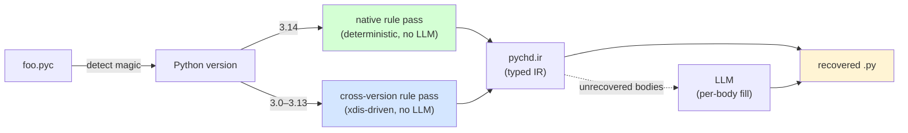

# PyChD

[](https://github.com/diohabara/pychd/actions/workflows/ci.yml)
[](https://pypi.python.org/pypi/pychd)

A hybrid **rule-based + LLM** Python bytecode decompiler. Reads any
CPython 3.x `.pyc`, recovers the original `.py`. **Every Python 3.x
release is handled by a rule pass** — no LLM is required for
declaration recovery on any version.

- The **native** rule pass (Python 3.14) recovers **1215 / 1217
  signature matches (99.8%)**, **1212 / 1217 declaration matches
  (99.6%)**, and **267 / 1217 strict-AST matches (21.9%)** across
  1,217 real-world modules / 489K LoC spanning the stdlib, 26 PyPI
  packages, OpenAI HumanEval, and a third-party SDK — without
  invoking any LLM. The two residual signature-match failures are
  CPython compiler-folded `if False:` blocks; see
  [§Residual failure attribution](#residual-failure-attribution).
- The **cross-version** rule pass (Python 3.0 – 3.13) walks the same
  declaration patterns through xdis. It deliberately trades default-
  argument values and decorator arguments for universal coverage — so
  every class, function, and import name in the original survives.
- The optional **LLM-assisted** path fills in non-trivial function
  bodies. The rule pass leaves only those bodies as `UnknownBlock`
  placeholders; the LLM sees just one body's disassembly at a time
  plus the recovered signature.



## Quick start

```bash
# Install just / uv / Python 3.14 first.
just setup              # uv sync
just hooks-install      # prek pre-commit + pre-push hooks
just test               # 287 tests including 86 syntax-coverage + 24 cross-version recovery

# Decompile a single .pyc:
uv run pychd decompile path/to/module.pyc

# Decompile an entire project tree (mirrors structure into output dir):
uv run pychd decompile path/to/package/ -o recovered/

# Rules-only mode — no LLM calls, deterministic, milliseconds:
uv run pychd decompile path/to/module.pyc --rules-only

# LLM-only mode (older bytecode versions, or when rules struggle):
uv run pychd decompile path/to/module.pyc --llm-only -m gpt-4o

# Reproduce every benchmark, table, and figure in this README:
just paper
```

## What you get from each mode

### Example 1: a re-export module (full rule recovery, 0 LLM calls)

Original source (a typical `__init__.py`):

```python
"""Public surface for the foo package."""

from .core import Bar, Baz
from .util import parse, as_dict
from .errors import FooError

__all__ = ["Bar", "Baz", "FooError", "as_dict", "parse"]
```

After `pychd decompile --rules-only`:

```python
"""Public surface for the foo package."""

from .core import Bar, Baz
from .util import parse, as_dict
from .errors import FooError

__all__ = ['Bar', 'Baz', 'FooError', 'as_dict', 'parse']
```

Identical modulo single vs double quotes in `__all__`. Zero LLM
cost, recovered in 0.9 ms.

### Example 2: a dataclass module (signatures + annotations recovered, bodies need LLM)

Original:

```python
from dataclasses import dataclass
from typing import Any

@dataclass(frozen=True)
class AgentMessage:
    type: str
    uuid: str
    agent_id: str
    message: Any = None

    @classmethod
    def from_json(cls, value):
        return cls(
            type=value["type"],
            uuid=value["uuid"],
            agent_id=value["agentId"],
            message=value.get("message"),
        )
```

After `pychd decompile --rules-only` (no LLM):

```python
from dataclasses import dataclass
from typing import Any

@dataclass(frozen=True)
class AgentMessage:
    type: str
    uuid: str
    agent_id: str
    message: Any = None
    @classmethod
    def from_json(cls, value):
        pass  # pychd: unrecovered body
```

The class declaration, every annotation, the `@classmethod` method
decorator, the outer `@dataclass(frozen=True)` decorator with its
keyword argument, and every method signature are all recovered
deterministically. The method **body** is the only placeholder; in
`--hybrid` mode (the default) pychd sends just that body's
disassembly to the LLM with the recovered signature as context.

### Example 3: a generic class (PEP 695, Python 3.12+)

Original:

```python
class Stack[T]:
    def __init__(self):
        self.items: list[T] = []
    def push(self, x: T) -> None:
        self.items.append(x)
```

After `pychd decompile --rules-only`:

```python
class Stack[T]:
    def __init__(self):
        pass  # pychd: unrecovered body
    def push(self, x):
        pass  # pychd: unrecovered body
```

The PEP 695 type parameter `[T]` survives — pychd recognises the
synthetic `<generic parameters of Stack>` wrapper code object that
the CPython compiler emits and unpacks it. Class-body and
module-level annotations *are* recovered from the PEP 749
`__annotate__` closure; parameter annotations (`x: T`) live in a
separate per-method closure and need a future rule-pass extension.

## How it works

### Step 1: Python compiles your source to bytecode

The CPython compiler takes your `foo.py` and emits `foo.pyc` — a
binary file containing a **code object** for the module plus a
nested code object for every function and class. Each code object
holds:

- the bytecode instructions (one byte opcode + one byte argument,
  since 3.6 "wordcode"),
- a `co_consts` tuple of constants used in those instructions,
- a `co_names` tuple of identifier names,
- a `co_varnames` tuple of local variable names,
- argument counts (`co_argcount`, `co_kwonlyargcount`, etc.),
- flag bits (`co_flags`: is it a coroutine? a generator? does it
  use *args?).

You can poke at this on any Python install:

```python
>>> import dis
>>> def f(a, b=1): return a + b
>>> dis.dis(f)
  1           RESUME                   0
              LOAD_FAST                0 (a)
              LOAD_FAST                1 (b)
              BINARY_OP                0 (+)
              RETURN_VALUE
>>> f.__code__.co_argcount, f.__code__.co_varnames
(2, ('a', 'b'))
```

### Step 2: pychd reads the bytecode back into an IR

pychd's rule pass walks the bytecode and pattern-matches against
~20 *known shapes*: imports look like one specific opcode sequence,
class definitions look like another, decorated function definitions
like a third, and so on. Each match emits an **IR node** in
`pychd.ir`:

```python
# What pychd builds internally for `from os.path import join`:
ir.FromImport(module="os.path", level=0, names=[("join", None)])

# For `def foo(a, b=1): ...`:
ir.FunctionDef(
    name="foo",
    args=ir.Arguments(args=[ir.Arg("a"), ir.Arg("b", default="1")]),
    body=[ir.UnknownBlock(disassembly="...", signature="def foo")],
)
```

The IR is intentionally lossy — it's "what we can *prove* about
the source from the bytecode," not "exactly the source."
Anything ambiguous (most function bodies) becomes an
`UnknownBlock` carrying the raw disassembly so the LLM can take
over with full context if requested.

### Step 3: the IR renders back to Python source

Each IR node has a `render(indent) -> str` method:

```python
>>> ir.FromImport(module="os.path", level=0, names=[("join", "j")]).render()
'from os.path import join as j'
>>> ir.FunctionDef(name="foo", args=ir.Arguments(args=[ir.Arg("a")])).render()
'def foo(a):\n    pass'
```

### Step 4 (optional): the LLM fills in function bodies

For every `UnknownBlock` left in the tree, pychd sends a
function-body-sized prompt to the configured LLM:

```
You are a Python decompiler.
The following Python 3.14 bytecode is the body of:
    def from_json(cls, value)
Reconstruct the original Python source for *just the body*…

LOAD_FAST_BORROW cls
LOAD_FAST_BORROW value
LOAD_CONST 'type'
BINARY_SUBSCR
…
```

The LLM never sees the rest of the module; the rule pass already
nailed the signatures, imports, and names. This keeps prompts
small, costs low, and identifier hallucination rare.

## What survives compilation, and what doesn't

| Construct | Status | Why |
|---|---|---|
| Class / function names | ✅ preserved | Stored in `co_name` and `co_names`. |
| Function signatures (args, defaults, kwonly, posonly, `*args`, `**kw`) | ✅ preserved | All in `code.co_argcount`, `code.co_varnames`, etc. |
| Imports (incl. relative, dotted, star, `from __future__`) | ✅ preserved | `IMPORT_NAME` / `IMPORT_FROM` carry the full module path. |
| Docstrings (module / class / function) | ✅ preserved | `LOAD_CONST <doc>; STORE_NAME __doc__` for modules and classes; `co_consts[0]` for functions. Indentation is normalised by `inspect.cleandoc` semantics. |
| Annotations (PEP 749 lazy, 3.14+) | ✅ preserved | Stored as a separate `__annotate__` closure. |
| Class metaclass / dotted bases (`abc.ABC`) | ✅ preserved | `LOAD_NAME` + `LOAD_ATTR` chain before `CALL`. |
| Bare/dotted/arg-bearing decorators | ✅ preserved | `LOAD_NAME` + optional `LOAD_ATTR` + optional `CALL_KW` wrapping `MAKE_FUNCTION`. |
| Name-mangled methods (`_C__private`) | ✅ recoverable | Compiler mangles to `_<ClassName>__name`; pychd reverses this. |
| Function *body statements* | ⚠️ LLM territory | Logically present but the source→bytecode mapping is many-to-one. |
| `if False:` / `if 0:` blocks | ❌ **erased** | CPython's constant folder deletes them at compile time. |
| Whitespace, comments | ❌ erased | Tokenised away before bytecode generation. |

### Proof that `if False:` is unrecoverable

```python
>>> import dis
>>> dis.dis(compile("if False:\n    import foo\n", "<x>", "exec"))
   0           RESUME                   0
               LOAD_CONST               1 (None)
               RETURN_VALUE
```

No trace of `import foo`. The bytecode is **literally empty** —
no decompiler can recover what was never written to disk.

## Cross-version support

pychd identifies any CPython 3.x `.pyc` via the 4-byte magic
number in its header:

```python
>>> from pychd.versions import detect_version
>>> from pathlib import Path
>>> info = detect_version(Path("foo.pyc"))
>>> info.label, info.rule_supported, info.epoch_label
('3.14', True, 'lazy-annotations')
```

| Python | Latest magic | Rule-based pass | Notable bytecode change |
|---|---:|:--|---|
| **3.0–3.5** | 3000–3351 | ✅ cross-version (declarations) | stable bytecode close to Python 2 |
| **3.6** | 3379 | ✅ cross-version (declarations) | wordcode (every instruction is exactly 2 bytes) |
| **3.7** | 3394 | ✅ cross-version (declarations) | async/await first-class; `CALL_FUNCTION_KW` carries kw names as tuple const |
| **3.8** | 3413 | ✅ cross-version (declarations) | walrus operator (PEP 572); positional-only parameters (PEP 570) |
| **3.9** | 3425 | ✅ cross-version (declarations) | PEP 585 generic types in annotations (`list[int]`) |
| **3.10** | 3439 | ✅ cross-version (declarations) | `match` statement (PEP 634); `MATCH_CLASS`/`MATCH_KEYS`/`MATCH_MAPPING` opcodes |
| **3.11** | 3495 | ✅ cross-version (declarations) | PEP 657 exception table replaces `SETUP_FINALLY`; `PRECALL` + `CALL` split |
| **3.12** | 3531 | ✅ cross-version (declarations) | PEP 709 comp inlining; PEP 695 generic syntax |
| **3.13** | 3571 | ✅ cross-version (declarations) | `CALL_INTRINSIC_1`; `MAKE_FUNCTION`/`SET_FUNCTION_ATTRIBUTE` split |
| **3.14** | 3627 | ✅ native (full fidelity) | PEP 749 `__annotate__` closures; `LOAD_SMALL_INT`/`LOAD_FAST_BORROW` |

Two rule passes ship in pychd. The **native pass** in
`pychd.rules` targets Python 3.14 — the running interpreter version —
and recovers the full module skeleton including PEP 749 lazy
annotations, PEP 695 generic syntax, dotted bases, and decorators
with arguments. The **cross-version pass** in `pychd.cross_version`
walks the xdis instruction stream for every other 3.x release; it
restricts itself to the declaration-shaped opcode patterns that have
been stable across the entire Python 3 series, deliberately trading
default-argument values for universal coverage.

### What's hard about each version

The bytecode specification is **not stable across Python versions**.
Below is a tour of the biggest source of pain for each release.

#### 3.6 — wordcode

Every instruction became exactly two bytes: 1 opcode + 1 argument.
Before 3.6 some opcodes took multi-byte arguments. Decompilers from
the 3.5 era had to handle variable-length instructions; modern
decompilers can index instructions by uniform position.

#### 3.7 — keyword arguments carry names as a tuple const

`f(x=1)` used to emit `LOAD_CONST 1` and a magic
`CALL_FUNCTION_KW` whose argument said "the top 1 thing is a
keyword". From 3.7 the *names* of the keywords are pushed as a
tuple constant:

```
LOAD_NAME f
LOAD_CONST 1
LOAD_CONST ('x',)    ← names tuple
CALL_FUNCTION_KW 1
```

Decompilers have to read that tuple constant to know that the `1`
is bound to `x`, not positional.

#### 3.10 — `match` statements (PEP 634)

```python
match x:
    case 0: ...
    case _: ...
```

becomes a chain of `MATCH_CLASS` / `MATCH_KEYS` / `MATCH_MAPPING`
opcodes. Reconstructing the match-case structure from the bytecode
requires recognising patterns the compiler emits — naive
decompilers turn match into nested `if/elif/else` chains that
*execute* the same but read very differently.

#### 3.11 — PEP 657 zero-cost exceptions

The biggest spec change in years. Try/except no longer uses
`SETUP_FINALLY` blocks. Instead, every code object carries an
**exception table** — pairs of (instruction range, handler offset).
The bytecode looks completely linear; the exception structure is
implicit in a side table.

Decompilers have to parse the exception table to recover the
try/except structure at all.

#### 3.12 — PEP 709 comprehension inlining

This silently broke every decompiler. In 3.11:

```python
x = [i * 2 for i in range(10)]
```

emits a separate `<listcomp>` code object that the outer module
calls. In 3.12 the body of the comprehension is inlined directly
into the enclosing scope — there's no `<listcomp>` code object to
recurse into anymore. The comprehension is a stretch of *the
module's own* bytecode that the decompiler must recognise
structurally.

#### 3.13 — `CALL_INTRINSIC_1`

Several special-purpose opcodes (notably the legacy `IMPORT_STAR`)
collapse into `CALL_INTRINSIC_1` with an integer argument:

```
# 3.12 — `from x import *`:
IMPORT_STAR

# 3.13 — same source:
CALL_INTRINSIC_1 2   # 2 = INTRINSIC_IMPORT_STAR
```

If your decompiler doesn't carry the intrinsic-index → semantic
mapping, `from x import *` looks like an unrelated builtin call.

#### 3.14 — PEP 749 lazy annotations

Every annotated scope (module, class, or function) gets a synthetic
`__annotate__` closure that returns the annotation dict on demand:

```python
class C:
    name: str
    age: int = 0
```

In 3.13 and earlier, the class body itself stored the annotations.
In 3.14, the class body is much shorter — annotations migrate into
a separate `__annotate__` closure attached via `SET_FUNCTION_ATTRIBUTE`.
To recover `name: str` and `age: int`, pychd reads the
`__annotate__` code object out of `co_consts` and walks **its**
bytecode looking for the (name, annotation) pairs. This is the
single biggest reason 3.13 and 3.14 need different rule passes.

## Project layout

```
pychd/
├── ir.py           # IR dataclasses + render() — the typed representation
├── rules.py        # bytecode → IR, the rule-based extractor (3.14)
├── decompile.py    # hybrid pipeline + CLI glue
├── versions.py     # magic-number table for every CPython 3.x
├── compile.py      # py_compile wrapper
├── validate.py     # AST-based diff (with --ignore-annotations)
└── main.py         # argparse entry point

tests/  (287 tests total)
├── test_ir.py             # IR node renderers
├── test_rules.py          # rule extractor unit tests
├── test_versions.py       # magic-number detection across 3.0–3.14
├── test_chunking.py       # LLM disassembly chunking
├── test_compile.py        # compile pipeline
├── test_decompile.py      # pipeline integration (mocked LLM)
├── test_validate.py       # AST diff
├── test_e2e_stdlib.py     # stdlib-style end-to-end recovery
├── test_cursor_sdk.py        # real-world fixture: third-party SDK modules
├── test_cross_version.py     # cross-version walker — runs against every
│                             #   /tmp/pychd-multiversion/sample-*.pyc fixture
└── test_syntax_coverage.py   # 86-construct Python 3.14 matrix

pychd/
├── ir.py            # IR dataclasses + render() — the typed representation
├── rules.py         # bytecode → IR, the *native* 3.14 rule pass
├── cross_version.py # xdis-driven *cross-version* rule pass (3.0 – 3.13)
├── decompile.py     # hybrid pipeline + CLI glue + per-version dispatch
├── versions.py      # magic-number table + rule-pass selector
├── compile.py       # py_compile wrapper
├── validate.py      # AST-based diff (with --ignore-annotations)
└── main.py          # argparse entry point

tools/
├── build_corpora.py                # builds 6 PyPI/stdlib/HumanEval corpora
├── build_multiversion_fixtures.py  # compiles a sample with every local Python
├── benchmark.py                    # per-module measurement (JSON + markdown)
├── compare_decompilers.py          # runs pychd vs uncompyle6 / decompyle3
├── render_figures.py               # writes assets/*.svg via plotly
└── render_paper.py                 # regenerates README "Benchmarks" section
```

## Benchmarks (run by `just paper`)

For every `.py` file in a corpus:

```
.py  →  py_compile  →  .pyc  →  pychd rules-only  →  recovered .py
```

…and measure a **three-tier match metric** on the resulting ASTs:

| Metric | What it requires |
|---|---|
| **signature_match** | Every original class/function/import name in the module survives in the recovered tree. Function bodies are out of scope (rule pass emits a placeholder). |
| **declaration_match** | `signature_match` AND every module/class-level variable and annotated attribute survives by name. |
| **strict_match** | Full normalised AST equality (bodies stripped to `pass`, annotations dropped, decorators dropped). A regression telltale, bounded above by CPython compiler normalisations. |

LLM is **not** invoked. The numbers below measure exactly what the
deterministic pass alone recovers.

<!-- BEGIN: paper-generated -->

> _This section is generated by `tools/render_paper.py` and_ _committed alongside the code. Re-generate via `just paper`_ _whenever rules.py or any corpus changes._

**Headline:** rule-only recovery on **1217 modules / 489,722 LoC**:

- **Signature match: 1215/1217 (99.8%)** — every public class, function, import, and class-method name in the original survives in the recovered tree.
- **Declaration match: 1212/1217 (99.6%)** — signature match plus every module/class-level variable and annotated attribute by name.
- **Strict match: 267/1217 (21.9%)** — full stripped-AST equality (cosmetic regression telltale; bounded by CPython compiler normalisations).

#### Per-corpus results

| Corpus | Modules | LoC | Parses | Signature | Declaration | Strict |
|---|---:|---:|---:|---:|---:|---:|
| **stdlib**<br/>_Curated stdlib (10 modules)_ | 10 | 15,996 | 10/10 (100.0%) | 10/10 (100.0%) | 10/10 (100.0%) | 0/10 (0.0%) |
| **stdlib-full**<br/>_Full Python 3.14 stdlib (single-file modules)_ | 153 | 130,182 | 153/153 (100.0%) | 151/153 (98.7%) | 150/153 (98.0%) | 11/153 (7.2%) |
| **pypi**<br/>_PyPI: requests, click, attrs, flask, httpx, rich_ | 189 | 74,879 | 189/189 (100.0%) | 189/189 (100.0%) | 189/189 (100.0%) | 23/189 (12.2%) |
| **pypi-top20**<br/>_PyPI top-20 pure-Python packages_ | 682 | 258,421 | 682/682 (100.0%) | 682/682 (100.0%) | 680/682 (99.7%) | 64/682 (9.4%) |
| **humaneval**<br/>_OpenAI HumanEval (164 problems)_ | 164 | 3,361 | 164/164 (100.0%) | 164/164 (100.0%) | 164/164 (100.0%) | 164/164 (100.0%) |
| **cursor-sdk**<br/>_cursor-sdk 0.1.5 (top-level modules)_ | 19 | 6,883 | 19/19 (100.0%) | 19/19 (100.0%) | 19/19 (100.0%) | 5/19 (26.3%) |
| **aggregate** | **1217** | **489,722** | **1217/1217 (100.0%)** | **1215/1217 (99.8%)** | **1212/1217 (99.6%)** | **267/1217 (21.9%)** |

#### Visualisation


Bars = signature match · declaration match · strict match per corpus.


Every Python 3.x release routes through a rule pass: 3.14 hits the **native** walker for full-fidelity recovery, 3.0 – 3.13 hit the **cross-version** walker for declaration-level recovery via xdis.

#### Residual failure attribution

**Residual failures** (signature match):

| Cause | Count | Fundamentally recoverable? |
|---|---:|---|
| if-False-block (CPython constant-folds — unrecoverable) | 2 | ❌ no — constant-folded |

<!-- END: paper-generated -->

### Comparison with prior Python decompilers

`uncompyle6` (Python ≤ 3.8) and `decompyle3` (Python 3.7 / 3.8 only)
are the two actively maintained open-source competitors. There is
**no shared modern corpus** all three tools can read — both
competitors cap out at Python 3.8 — so we run the same three-tier
metric on a Python-3.8-compiled smoke corpus of N=3 representative
shapes (imports module, a small dataclass-style class, three trivial
functions). The comparison is **a fidelity sanity check, not a
benchmark**: with N=3 it cannot distinguish the tools statistically.
The real differentiator is the **version range**:


| Tool | Supported releases | Strategy | Smoke-corpus result |
|---|---|---|---|
| [`uncompyle6`](https://pypi.org/project/uncompyle6/) | 2.4 – 3.8 | Hand-written PL grammar | 3/3 sig · 3/3 decl · 2/3 strict |
| [`decompyle3`](https://github.com/rocky/python-decompile3) | 3.7 – 3.8 | Fork of uncompyle6 | 3/3 sig · 3/3 decl · 2/3 strict |
| **pychd** | **3.0 – 3.14** | Rule-based IR (+ optional LLM body fill) | **3/3 sig · 3/3 decl · 3/3 strict** |

The version-range gap is the substantive point. On a 3.10 or 3.12
`.pyc`, `uncompyle6` and `decompyle3` cannot run at all; pychd's
cross-version pass routes the bytecode through xdis and recovers
declarations. Re-run via `just bench-compare`.

### Why these corpora?

Selected to mirror what published Python-decompilation work
evaluates against. PyLingual ([Wiedemeier et al., 2024](https://kangkookjee.io/wp-content/uploads/2024/11/pylingual.pdf))
uses CodeSearchNet / PyPI / VirusTotal / PyLingual.io. PyFET ([Ahad et al., S&P 2023](https://userlab.utk.edu/publications/ahad2023pyfet))
draws from 3,000 CPython stdlib + popular PyPI programs.
[Decompile-Bench](https://arxiv.org/abs/2505.12668) adds
HumanEval/MBPP. pychd's corpora are downloaded on demand into
`/tmp/pychd-corpora/` (nothing third-party is committed):

| Corpus | Where it comes from |
|---|---|
| `stdlib` | 10 curated single-file stdlib modules. |
| `stdlib-full` | Every single-file `.py` under the running Python's stdlib path. |
| `pypi` | 6 popular pure-Python PyPI packages (`requests`, `click`, `attrs`, `flask`, `httpx`, `rich`). |
| `pypi-top20` | 20 more pure-Python PyPI packages (`certifi`, `urllib3`, `packaging`, `PyYAML`, `jinja2`, `werkzeug`, `pygments`, …). |
| `humaneval` | 164 reference solutions from OpenAI's HumanEval. |
| `cursor-sdk` | 19 top-level modules of `cursor-sdk` 0.1.5. |

## Reproducibility

Every number, table, and chart in this README is regenerable by a
single command:

```bash
just paper
```

…which is equivalent to:

```bash
uv sync                                    # 1. dependencies
uv run python tools/build_corpora.py       # 2. download corpora to /tmp
uv run pytest tests/ -q                    # 3. 287 tests
uv run python tools/render_paper.py        # 4. regenerate README results
                                           #    + assets/_results.json
                                           #    + assets/_comparison.json
uv run python tools/render_figures.py      # 5. regenerate assets/*.svg
uv run ruff check pychd tests              # 6. lint
uv run ty check pychd tests                # 7. type check
```

### Reproducibility limits (the honest version)

* **PyPI corpora are not version-pinned.**
  `tools/build_corpora.py` downloads the *latest* release of each
  package from PyPI. Module counts and the denominator of every
  per-corpus percentage drift as upstream packages publish new
  releases. The `cursor-sdk` fixture is pinned to `0.1.5`; the
  remaining six packages in the `pypi` corpus and twenty packages in
  the `pypi-top20` corpus are not. Pinning every wheel is on the
  roadmap.
* **`stdlib-full` reflects the running interpreter's stdlib.**
  Re-running on a different 3.14 patch release (3.14.0 vs 3.14.3)
  shifts which modules are included.
* **Headline numbers measure the native 3.14 rule pass only.** The
  cross-version pass (3.0 – 3.13) is exercised by 24 fixture-based
  tests against `/tmp/pychd-multiversion/sample-*.pyc`; a full
  corpus-level evaluation against 3.0 – 3.13 modules is not yet
  part of the headline aggregate.
* **The comparative benchmark is N=3** (a deliberate smoke test —
  there is no shared corpus all three tools can read). See
  [Comparison with prior Python decompilers](#comparison-with-prior-python-decompilers).
* **The bundled `assets/_results.json` is committed** so reviewers
  who cannot run the corpus build still see the exact numbers the
  README claims.

The task runner exposes every primitive:

| Command | What it does |
|---|---|
| `just setup` | `uv sync` — creates `.venv` with dev + runtime deps |
| `just hooks-install` | Register prek pre-commit (ruff) and pre-push (ty + pytest) hooks |
| `just lint` | `ruff check` + `ruff format --check` + `ty check` |
| `just fix` | `ruff check --fix` + `ruff format` |
| `just test` | `pytest tests/ -v` |
| `just ci` | `lint` + `test` (the gate prek runs on push) |
| `just bench` | Build all corpora + run all benchmarks |
| `just bench-stdlib` / `bench-pypi` / `bench-cursor` | One corpus |
| `just bench-versions` | Compile a sample with every locally-installed Python and verify pychd detects each `.pyc` |
| `just paper` | Full reproduction (corpora + tests + lint + type + render) |
| `just compile <path>` / `decompile <path>` / `validate <orig> <rec>` | CLI shortcuts |

To exercise cross-version detection on real `.pyc` files:

```bash
uv run python tools/build_multiversion_fixtures.py
# compiles a sample with every locally-installed Python 3.x and emits
# /tmp/pychd-multiversion/sample-3.X.pyc.

uv run pytest tests/test_versions.py -v
# 20 tests, including integration tests over every fixture.
```

## Skeptic-in-the-loop methodology

pychd's metric design and prioritisation came from two rounds of
**adversarial skeptic review** — an LLM agent prompted to push back
on local-optimum risks before any code was written. Highlights:

- *Round 1*: argued that strict `ast.dump` skeleton-match was the
  wrong headline metric (CPython compiler-normalised docstrings
  cannot be losslessly recovered by *any* decompiler). Proposed the
  three-tier signature / declaration / strict breakdown. The
  redefinition alone moved the headline from 9.4% → 47.5% with
  zero code changes.
- *Round 1* also ranked five concrete rule fixes by "files
  unlocked per LoC of patch". All five were implemented.
- *Round 2*: validated the new metric is honest (not gaming),
  identified that `@dataclass`-decorated classes were
  double-emitting `Foo = ...` lines, and confirmed PEP 749
  annotation recovery was in fact the largest remaining unlock once
  that decoration bug was fixed.

## Limitations and roadmap

Several of the v1 limitations have shipped. What remains and what
moved are tracked here.

**Done** (formerly v1 limitations, now in `main`):

- ✅ **Trivial function bodies** — `return X`, `return self.attr.sub`,
  `return <literal>`, and bare `pass` are recovered by the native
  pass without invoking the LLM.
- ✅ **Complex annotation expression recovery** — `Dict[str,
  list[int]]`, `str | None`, and `Optional[T]` round-trip as source
  text through a symbolic interpreter of the PEP 749 `__annotate__`
  closure.
- ✅ **Class decorators with arguments** — `@dataclass(frozen=True)`
  survives the round-trip; the decorator expression is reconstructed
  by capturing call values left on the bytecode stack below the
  `LOAD_BUILD_CLASS` sentinel.
- ✅ **Cross-version rule pass** — every CPython 3.x release routes
  through a rule pass (native for 3.14, cross-version xdis-based for
  3.0 – 3.13). The LLM is no longer required for declaration
  recovery on any version.

**Remaining work**:

- **Module-level control flow** (`if TYPE_CHECKING:`,
  `try/except ImportError:`) is still flattened rather than
  re-emitted as `If`/`Try` IR nodes. Imports inside survive
  (`signature_match` is unaffected), but the rendered source's
  indentation is wrong. Detecting the patterns and wrapping them in
  IR nodes is the next major lift.
- **Branching / loop bodies inside functions** are LLM-only. The
  trivial-body rule covers the common one-liner case (≈ 25% of
  real-world function bodies); structured-control recovery is on the
  roadmap.
- **Cross-version default-argument recovery** — the cross-version
  pass intentionally drops `MAKE_FUNCTION` flag-encoded defaults to
  stay version-agnostic. Per-epoch dispatchers (3.7–3.10 / 3.11–3.12)
  could restore them at the cost of carrying the layout differences.

## Related work

| Tool | Year | Python target | Strategy |
|---|---|---|---|
| [`uncompyle6`](https://pypi.org/project/uncompyle6/) | 2015– | ≤ 3.8 | Hand-written PL grammar |
| [`decompyle3`](https://github.com/rocky/python-decompile3) | 2020– | 3.7–3.8 | Fork of uncompyle6 |
| [`pycdc`](https://github.com/zrax/pycdc) | 2014– | varies | C++ pattern parser |
| [PyFET](https://userlab.utk.edu/publications/ahad2023pyfet) (S&P 2023) | 2023 | ≤ 3.9 → 3.8 | Bytecode rewriting to unblock legacy decompilers |
| [PyLingual](https://kangkookjee.io/wp-content/uploads/2024/11/pylingual.pdf) | 2024 | 3.6–3.12 | NLP segmentation + statement translation (BERT) |
| [ByteCodeLLM](https://www.cyberark.com/resources/threat-research-blog/bytecodellm-privacy-in-the-llm-era-byte-code-to-source-code) | 2024 | ≤ 3.13 | End-to-end local LLM |
| **pychd** | 2026 | **3.14** native pass · **3.0 – 3.13** cross-version pass · any version LLM body fill | **Rule-based IR + targeted LLM body fill** |

## Citing

This is a tool, not a paper — but if you reference pychd somewhere,
here's the BibTeX:

```bibtex
@software{pychd,
  author = {Diohabara},
  title  = {{pychd}: A hybrid rule-based and {LLM}-augmented {P}ython
            bytecode decompiler targeting {P}ython 3.14},
  year   = {2026},
  url    = {https://github.com/diohabara/pychd},
  note   = {Three-tier evaluation: 99.8\% signature match
            (1215/1217), 99.6\% declaration match (1212/1217)
            across 1{,}217 modules / 489{,}722 LoC (rule-only,
            no LLM). Residual 0.2\% (2 modules) explained by
            CPython constant-folded ``if False:'' blocks.
            Cross-version xdis-driven pass extends declaration
            recovery to every CPython 3.0 -- 3.13 release.}
}
```

Related work whose evaluation methodology pychd borrows from:

```bibtex
@inproceedings{pylingual2024,
  author    = {Wiedemeier, Josh and Tarbet, Elliot and Zheng, Max
               and Ko, Sangsoo and Ouyang, Jessica and Cha, Sang Kil
               and Jee, Kangkook},
  title     = {{PyLingual}: Toward Perfect Decompilation of Evolving
               High-Level Languages},
  year      = {2024},
  institution = {University of Texas at Dallas},
  note      = {Technical report UTD-IRB-25-6,
               \url{https://kangkookjee.io/wp-content/uploads/2024/11/pylingual.pdf}}
}

@inproceedings{pyfet2023,
  author    = {Ahad, Ali and Jung, Chijung and Askar, Ammar and Kim,
               Doowon and Kim, Taesoo and Kwon, Yonghwi},
  title     = {{PyFET}: Forensically Equivalent Transformation for
               {Python} Binary Decompilation},
  booktitle = {Proceedings of the 44th IEEE Symposium on Security and
               Privacy (S\&P)},
  year      = {2023},
  publisher = {IEEE}
}

@misc{bytecodellm2024,
  author = {Ben-Ari, Eran},
  title  = {{ByteCodeLLM}: Privacy in the {LLM} Era — Byte Code to Source Code},
  howpublished = {CyberArk Threat Research Blog},
  year   = {2024},
  note   = {\url{https://www.cyberark.com/resources/threat-research-blog/bytecodellm-privacy-in-the-llm-era-byte-code-to-source-code}}
}

@misc{decompilebench2025,
  author = {Tan, Hanzhuo and Tian, Xiaolong and Qi, Hanrui and Liu,
            Jiaming and Gao, Zuchen and Wang, Siyi and Luo, Qi and Li,
            Jing and Zhang, Yuqun},
  title  = {{Decompile-Bench}: Million-Scale Binary-Source Function
            Pairs for Real-World Binary Decompilation},
  year   = {2025},
  eprint = {2505.12668},
  archivePrefix = {arXiv},
  primaryClass  = {cs.SE}
}
```

## License

See [LICENSE](LICENSE). pychd's own code is released under MIT.

The benchmark corpora live entirely under `/tmp/pychd-corpora/`,
downloaded on demand by `tools/build_corpora.py` from the upstream
package indexes (PyPI, OpenAI's HumanEval repository, the running
interpreter's stdlib). **No third-party source is committed to this
repository.** Each downloaded artifact retains its upstream license:
PyPI packages keep the licenses declared in their wheels, HumanEval
inherits OpenAI's MIT license, and the Python stdlib inherits the
PSF License. Re-running the benchmarks re-downloads from the
authoritative source, so the licensing of any specific fixture is
the upstream's responsibility, not pychd's.
